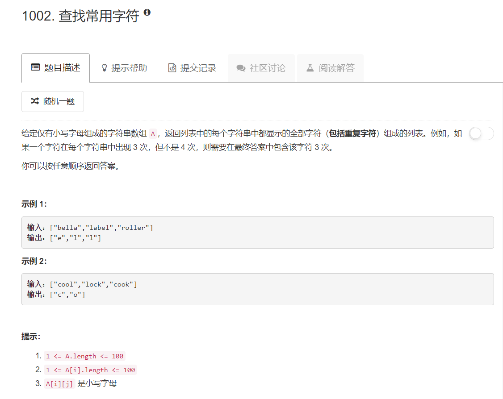

# 1002 - 查找常用字符

## 题目描述


>题意：  


## 题解一
思路：  
1. 计算每个单词中每个字母出现的次数，保存为dict;
2. 以任意一个单词的所有字母为基准建立结果dict，key为字母，val为字母出现的次数（初始化为正无穷）；
3. 对结果dict中的每个字母，检查其是否出现在每个单词中:
    - 若出现了，将结果数组中的val设为出现的最小次数;
    - 若未出现，说明这个字母没有出现在所有单词中，将其从结果dict中删去；
4. 根据结果dict构造结果list并返回。

```python
from collections import Counter
class Solution(object):
    def commonChars(self, A):
        """
        :type A: List[str]
        :rtype: List[str]
        """
        # c = Counter()
        dicts = []
        for x in A:
            dicts.append( dict(Counter(x)) ) 
        
        letters = dicts[0].keys()
        minimum = [float('inf')] * len(letters)
        result = dict(zip(letters, minimum))
        for letter in letters:
            for d in dicts:
                if letter in d:
                    result[letter] = min(d[letter], result[letter])
                else:
                    del result[letter]
                    break
        
        result_list = []
        for key in result.keys():
            result_list += [key] * result[key]
        return result_list
```


## 题解二
[Python 1 Line](https://leetcode.com/problems/find-common-characters/discuss/247560/Python-1-Line)
再次被这位大神秒杀，**lee215**我要记住你的名字！！！虽然思路差不多，emmmm牵强地说差不多吧哈哈，写出来怎么差这么远，积累积累啊。  
>原来Counter是可以这样按位与的，原来Counter还有elements这么个方便的属性，根本不用自己构造一个结果list。。。

```python
from collections import Counter
class Solution(object):
    def commonChars(self, A):
        """
        :type A: List[str]
        :rtype: List[str]
        """
        # c = Counter()
        res = Counter(A[0]) 

        for a in A:
            res &= Counter(a)
        return list(res.elements())
```

one-line版本：  
>这个collections.Counter.\__and__目测就是“与”操作。


```python
from collections import Counter
from functools import reduce 
class Solution(object):
    def commonChars(self, A):
        """
        :type A: List[str]
        :rtype: List[str]
        """

        return list( reduce(Counter.__and__, map(Counter, A)).elements() )
```
