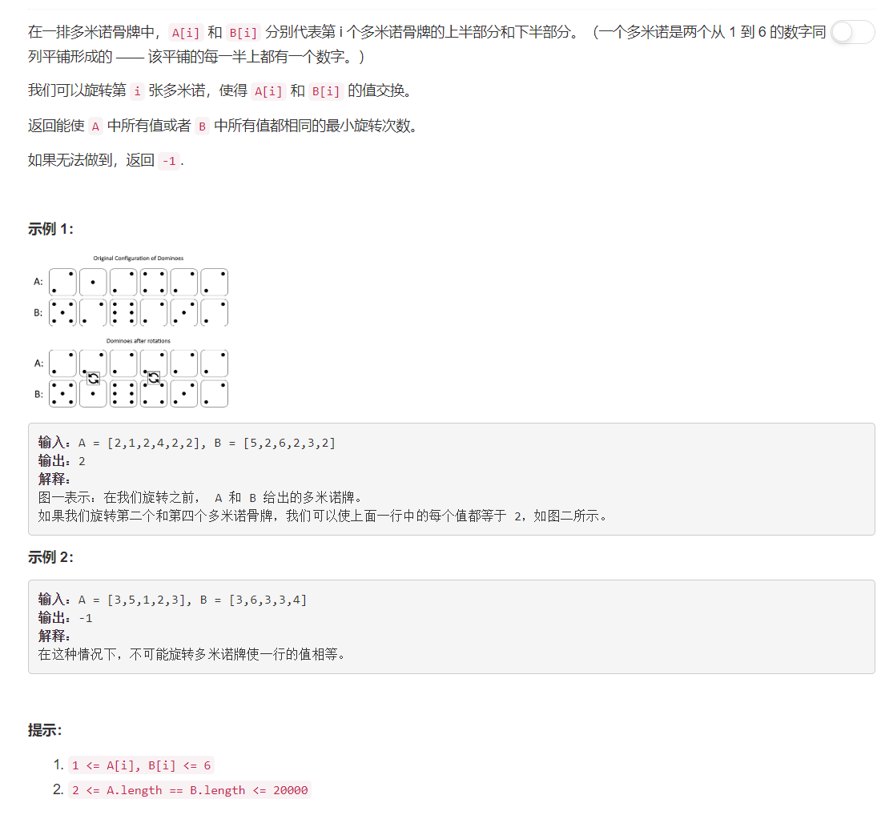

# 1007 - 行相等的最少多米诺旋转

## 题目描述



## 题解一
**思路：** 就从1到6一个个尝试，反正也不多嘛。 大神的代码里在找到了一个可以满足要求的情况就立马返回了，我一开始觉得大神这里考虑有欠缺，万一还有别的数有更少的旋转次数呢？改完代码才发现我想多了，如果说要满足一排中是同一个数字n，那个至少就有len(domino)个n，这时找出的结果已经是最佳了。至多有种情况是存在另一个数字m和n都恰好出现len(domino)次，那么将m旋转至同一排的次数和将n旋转至同一排的次数肯定是一样的。所以并不需要计算每个数字的情况。。。  

>但无论如何，这个方法都非常的慢，慢，慢

```python
class Solution(object):
    def minDominoRotations(self, A, B):
        """
        :type A: List[int]
        :type B: List[int]
        :rtype: int
        """
        min_rotate = float('inf')
        for x in range(1, 7):
            if all(x == a or x == b for a, b in zip(A, B)):
                min_rotate = min( min_rotate,len(A) - A.count(x), len(B) - B.count(x))
        
        return -1 if min_rotate == float('inf') else min_rotate
```

concise版本：
```python
class Solution(object):
    def minDominoRotations(self, A, B):
        """
        :type A: List[int]
        :type B: List[int]
        :rtype: int
        """
        min_rotate = float('inf')
        for x in range(1, 7):
            if all(x == a or x == b for a, b in zip(A, B)):
                min_rotate = min( min_rotate,len(A) - A.count(x), len(B) - B.count(x))
        
        return -1 if min_rotate == float('inf') else min_rotate
```


## 题解二
分别使用A[0]与B[0]作为基准（要旋转到一排的那个数），遍历两个数组，计算最少旋转次数。为什么只用和A[0]与B[0]比较就行了呢，因为要满足旋转后整排都是这个数，那么它一定会在每一个domino出现，包括第一个，而A[0]与B[0]组合起来就是第一个domino呀。

> 提速到了top35%左右。可以看到上下两部分代码其实一模一样，忙着洗头就不合并了 _(:з)∠)_

```python
class Solution(object):
    def minDominoRotations(self, A, B):
        """
        :type A: List[int]
        :type B: List[int]
        :rtype: int
        """
        n = len(A)

        # 以A[0]为基准
        a, b = 0, 0
        candidate = A[0]
        for i in range(n):
            if A[i] != candidate and B[i] != candidate: break   # 上下domino都没出现，没希望啦
            a += int(A[i] != candidate)                         # 将这个数旋转到上面需要的次数
            b += int(B[i] != candidate)                         # 将这个数旋转到下面需要的次数
            i += 1
            if i == n: return min(a, b)
        
        # 以B[0]为基准
        a, b = 0, 0
        candidate = B[0]
        for i in range(n):
            if A[i] != candidate and B[i] != candidate: break   # 上下domino都没出现，没希望啦
            a += int(A[i] != candidate)                         # 将这个数旋转到上面需要的次数
            b += int(B[i] != candidate)                         # 将这个数旋转到下面需要的次数
            i += 1
            if i == n: return min(a, b)

        return  -1
```

## 题解三
**思路：**   寻找所有{A[i], B[i]}的交集S，这个交集就是在每一块domino都出现了的数字：
- S为空：没有可行解；
- S中有一个数：这个数就是唯一可以满足旋转后到一整排的， 唯一解；
- S中有两个数：这两个数同时出现在每一块domino上，两个数旋转到同一排需要的次数是一样的；
- S中不可能有超过两个数的哟！那不出老千嘛(●ˇ∀ˇ●)

> 提速到了top15%左右。

```python
from functools import reduce
class Solution(object):
    def minDominoRotations(self, A, B):
        """
        :type A: List[int]
        :type B: List[int]
        :rtype: int
        """
        intersection = reduce(set.__and__, [set(d) for d in zip(A, B)] )
        if not intersection: 
            return -1
        else:
            x = intersection.pop()   # 就是你，幸运儿！
            return  min(len(A) - A.count(x), len(B) - B.count(x))
```