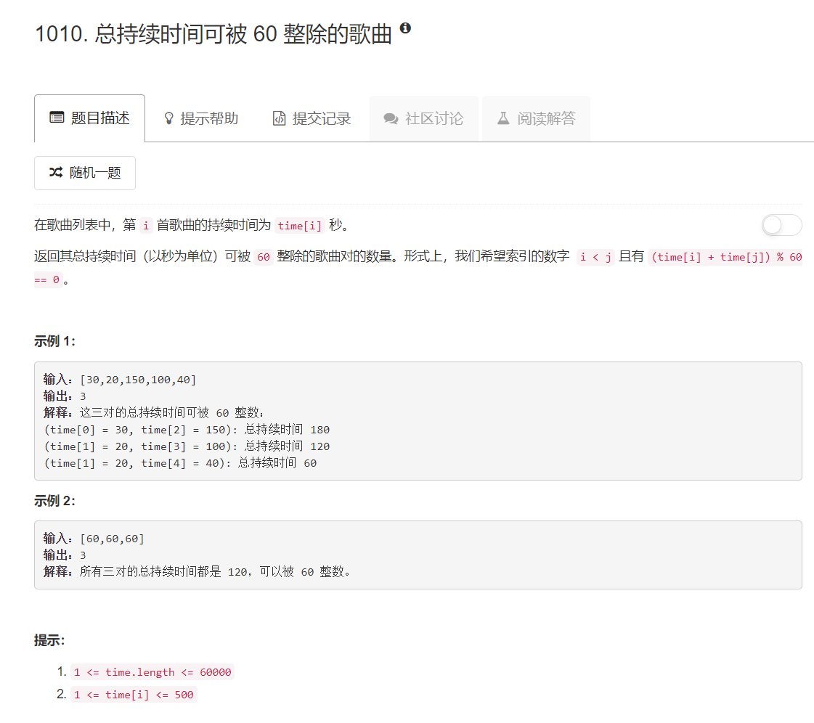

# 1010 - 总持续时间可被 60 整除的歌曲

## 题目描述



## 题解一
暴力双重循环， 果然超时。。。

```python
class Solution(object):
    def numPairsDivisibleBy60(self, time):
        """
        :type time: List[int]
        :rtype: int
        """
        length = len(time)
        count = 0
        for i in range(length - 1):
        	j = i + 1
        	while j < length:
        		if (time[i] + time[j]) % 60 == 0:
        			count += 1
        		j += 1
        return count
```


## 题解二
依然是大神**lee215**，卑微的低下了头。为什么人家还能想到和 Two Sum 类似，而我，抄别人的解法抄完就忘。。。  

思路：
1. 计算整个数组的余数；
2. 计算每个余数有多少个；
3. 要满足两数之和未60，那么直接看其余数的情况：
	- 两个数本身就能被60整除，则其余数都是0，这样的数来多少个就有多少个两两之和能被60整除的组合；
	- 两个数的余数之和为60：
		- 余数为30，两个数都被计入了余数为30的情况，这个时候需要除以二，才是和能被60整除的组合数；
		- 其他情况，计算之后将次数清零，防止二次计算（比如算过20之后又遇到40，其实在算20的时候已经算了40的情况）。

>好不容易平平凑凑一个可行的代码，同样的例子本地跑是对的，提交上去跑就错了。。。

```python
from collections import Counter
class Solution(object):
    def numPairsDivisibleBy60(self, time):
        """
        :type time: List[int]
        :rtype: int
        """
        count = 0
        remainder = [i%60 for i in time]	# 计算余数
        c = Counter(remainder)				# 计算每一个大小的余数的个数

        for x in c.keys():
        	if x == 0:
        		count += c[x]
        	elif x == 30:
        		count += c[x] // 2
        	else:
        		count += c[60-x]
        		c[x] = 0
        return count
```

## 题解三
好了，不得不搬出大神的代码了，思路和上面差不多，也是算余数计数，不过步骤简单了许多。  
判断两数是否关于60互补的方法： 如果a,b两数之和为60，则**-a%60 == b%60**;


```python
from collections import Counter
class Solution(object):
    def numPairsDivisibleBy60(self, time):
        """
        :type time: List[int]
        :rtype: int
        """
        count = 0
        c = Counter()

        for x in time:
        	count += c[ -x % 60 ]
        	c[ x % 60 ] += 1
        return count
```
