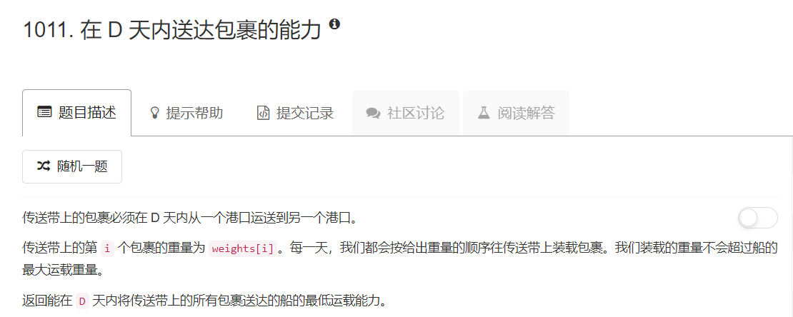
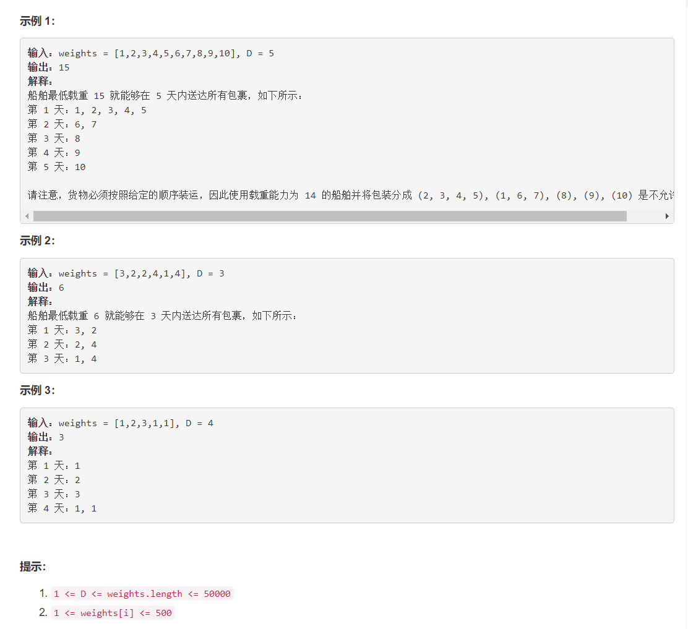

# 1011 - 在 D 天内送达包裹的能力

## 题目描述



>相似题目：  
[875.爱吃香蕉的珂珂](https://github.com/Rosevil1874/LeetCode/tree/master/Python-Solution/875_Koko_Eating_Bananas)


## 题解 【二分查找】
>看到这题的相关话题里有二分查找，就在纳闷这个怎么能二分查找呢，明明要按照原始顺序运输，不能排序的呀~ 然后偷偷瞄一眼才发现是在capacity的可行范围内二分查找最佳capacity。  

**思路：**  
1. 最低运载能力一定不能小于最重包裹的重量，同时不会超过所有包裹的总重量；
2. 在capacity的可行范围内二分查找：
	- 若最小使用天数大于D，增大capacity，否则减小capacity；
	- 若最小使用天数等于D，尝试继续减小capacity，直到找到符合条件的最小capacity；

```python
class Solution(object):
    def shipWithinDays(self, weights, D):
        """
        :type weights: List[int]
        :type D: int
        :rtype: int
        """
        left, right = max(weights), sum(weights)
        while left < right:
        	mid = (left + right) // 2
        	need, weight = 1, 0
        	for x in weights:
        		if weight + x > mid:
        			need += 1
        			weight = 0
        		weight += x
        	if need > D:
        		left = mid + 1
        	else:
        		right = mid
        return left
```

