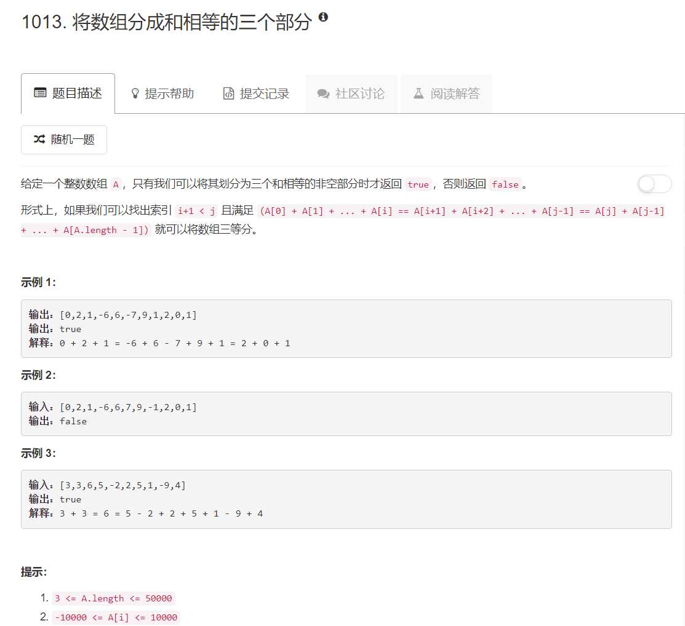

# 1013 - 将数组分成和相等的三个部分

## 题目描述



## 题解一
思路：
1. 左右两个指针分别控制从两头向中间加的和；
2. 若两边的和相等，计算中间剩余值的和：
    - 若中间值的和与两边相等，则可以成功分成和相等的三部分；
    - 否则继续移动两端指针进行加和。

>只在题目上的3个测试用例上行得通，提交时在用例“[18,12,-18,18,-19,-1,10,10]”上卡住了

```python
class Solution(object):
    def canThreePartsEqualSum(self, A):
        """
        :type A: List[int]
        :rtype: bool
        """
        length = len(A)
        l, r = 0, length - 1
        l_sum, r_sum = A[l], A[r]
        
        while l < r:
            if l_sum == r_sum:
                m_sum = sum(A[l + 1:r])
                if l_sum == m_sum:
                    return True

            if l_sum  <= r_sum :
                l_sum += A[l + 1]
                l += 1
            else:
                r_sum += A[r - 1]
                r -= 1
        return False
```


## 题解二
一个超简单的思路:
1. 首先，和不能平均分成3份的数组直接淘汰掉；
2. 先算出来如果要分成三分和相等的子序列，每个子序列的和应该是多少。然后从头往后加，加到期望的和就分出一个子序列，看能不能分成三个这样的子序列就行。

```python
class Solution(object):
    def canThreePartsEqualSum(self, A):
        """
        :type A: List[int]
        :rtype: bool
        """
        if sum(A)%3 != 0:
            return False

        the_sum = sum(A) // 3
        partition = 0

        s = 0
        for i in range(len(A)):
            s += A[i]
            if s == the_sum:
                partition += 1
                s = 0
                if partition == 2 and sum(A[i+1:]) == the_sum:
                    return True
        return False
```

