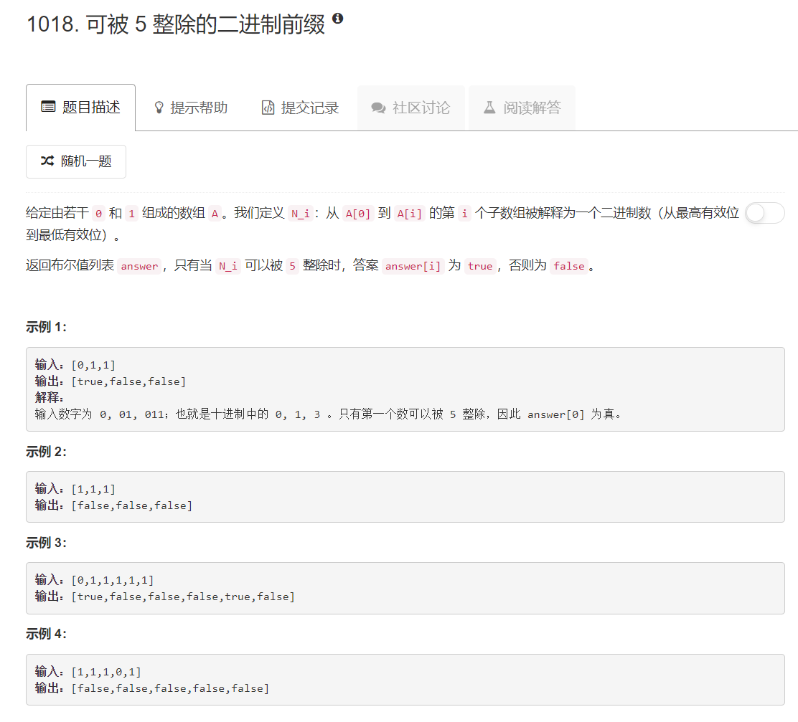

# 1018 - 可被 5 整除的二进制前缀

## 题目描述



## 题解一
思路：
逐位判断，每向右端加一位相当于这个二进制数乘上2再加上加的那一位值，然后判断每次变化后能否被5整除就行了（不知道有没有表达清楚，talk is cheap，see the code）。  

>beat50%, 啊超满足了，主要是这题解的快，嘻嘻。

```python
class Solution(object):
    def prefixesDivBy5(self, A):
        """
        :type A: List[int]
        :rtype: List[bool]
        """
        length = len(A)
        res = [False] * length
        num = 0
        for i in range(length):
        	num = num*2 + A[i]
        	if num % 5 == 0:
        		res[i] = True
        return res
```

看了一下，思路基本上都是一样的，但别人的就是快，比如，加了一行，每次判断后使用余数计算，就beat 100%了。这个没有说服力啊，一定是网速问题，于是我又提交了一次我上面的代码，哈，就beat 82% 了。咋回事儿~

```python
class Solution(object):
    def prefixesDivBy5(self, A):
        """
        :type A: List[int]
        :rtype: List[bool]
        """
        length = len(A)
        res = [False] * length
        num = 0
        for i in range(length):
        	num = num*2 + A[i]
        	if num % 5 == 0:
        		res[i] = True
        	num%=5
        return res
```

下面这个版本也是每次用余数接着运算，每次运算从十进制运算换成了位运算，对二进制来说更值观一些。

```python
class Solution(object):
    def prefixesDivBy5(self, A):
        """
        :type A: List[int]
        :rtype: List[bool]
        """
        res = []
        num = 0
        for i, a in enumerate(A):
        	num = (num<<1 | a) % 5
        	res.append(num == 0)
        return res
```