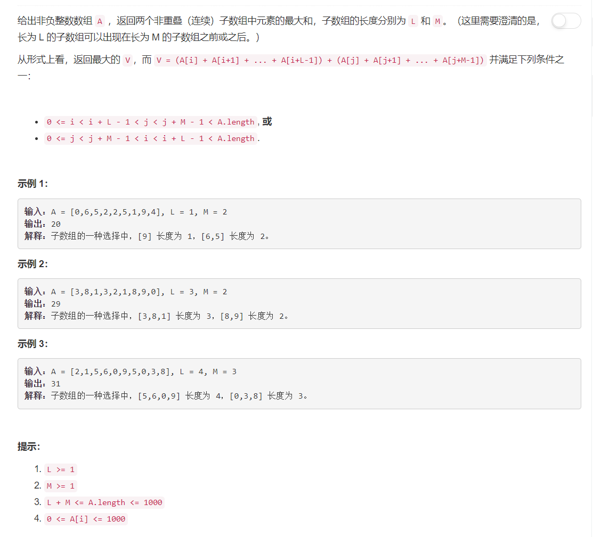

# 1031 - 两个非重叠子数组的最大和

## 题目描述



## 题解一
**思路：**
从索引L+M处开始遍历，每次同时找最近的M个元素的和与前面L个元素的和的最大值，以及最近的L个元素的和与前面M个元素的和的最大值。返回其中较大的一个。

>[传送门](https://leetcode.com/problems/maximum-sum-of-two-non-overlapping-subarrays/discuss/278251/JavaC%2B%2BPython-O(N)Time-O(1)-Space)

```python
class Solution(object):
    def maxSumTwoNoOverlap(self, A, L, M):
        """
        :type A: List[int]
        :type L: int
        :type M: int
        :rtype: int
        """
        for i in range(1, len(A)):
            A[i] += A[i - 1]
            res, Lmax, Mmax = A[L + M - 1], A[L - 1], A[M - 1]
            for i in range(L + M, len(A)):
                Lmax = max(Lmax, A[i - M]- A[i - L - M])
                Mmax = max(Mmax, A[i - L]- A[i - L - M])
                res = max(res, Lmax + A[i] - A[i - M], Mmax + A[i] - A[i - L])
        return res
```
