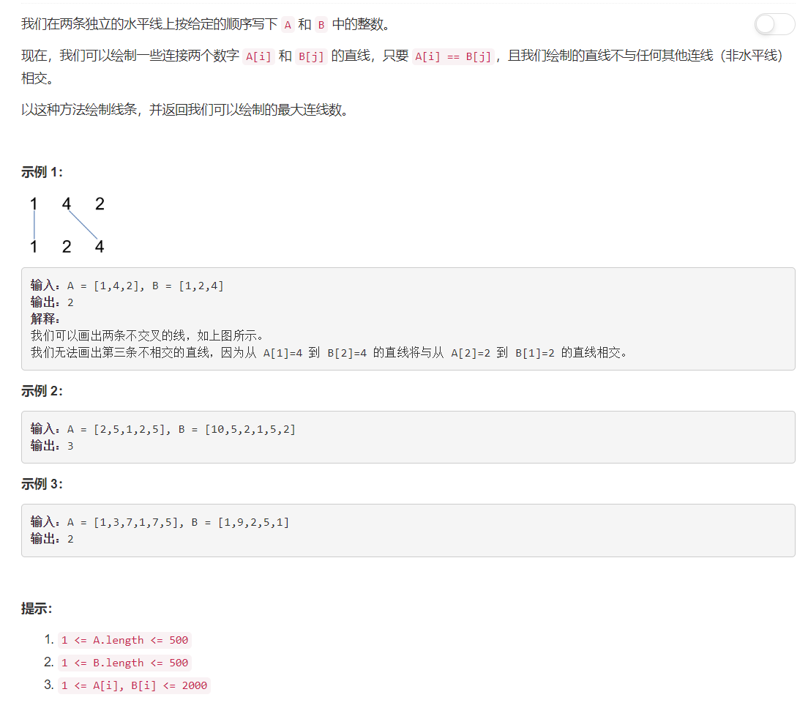

# 1035 - 不相交的线

## 题目描述


>要求：
1. 连线不能相交；
2. 连线不能共用端点

## 题解一【简单遍历】
**思路：**
1. 每次选择一个基准数组，遍历基准数组；
2. 从另一数组中寻找与基准数组当前值相同的值，找到即连线加一，并且此后在另一数组中从当前索引后面开始找相同，保证满足连线不相交和不共用端点条件；
3. 分别使用两个数组作为基准计算连线数，返回数量多的那个。


```python
class Solution(object):
	def maxUncrossedLines(self, A, B):
		"""
		:type A: List[int]
		:type B: List[int]
		:rtype: int
		"""
		lenA, lenB = len(A), len(B)
		countA, countB = 0, 0
		startA, startB = 0, 0

		for i in range(lenA):
			for j in range(startA, lenB):
				if A[i] == B[j]:
					# print(i, j)
					countA += 1
					startA = j + 1
					break
		for i in range(lenB):
			for j in range(startB, lenA):
				if B[i] == A[j]:
					# print(i, j)
					countB += 1
					startB = j + 1
					break
		return max(countA, countB)
```

果然行不通啊，哭泣，这个方法只对题目上几个用例管用。。。


## 题解二【动态规划】
含泪打出上面失败的结果的同时，突然想到，诶---这不是最长公共子序列吗！去讨论区一看，果然，Longest Common Subsequence 😄  

LCS的动态规划过程参考学算法导论的时候帮助理解的一个博客(满满回忆呐，看吧，一不小心又忘了)
[算法笔记最长公共子序列问题](https://blog.csdn.net/liufeng_king/article/details/8500084)；以下是LCS的DP方程


>时间复杂度：O(N^2), 空间复杂度：O(N^2)

```python
import collections
class Solution(object):
	def maxUncrossedLines(self, A, B):
		"""
		:type A: List[int]
		:type B: List[int]
		:rtype: int
		"""
		lenA, lenB = len(A), len(B)
		dp = collections.defaultdict(int)
		for i in range(lenA):
			for j in range(lenB):
				if A[i] == B[j]:
					dp[i, j] = dp[i - 1, j - 1] + 1
				else:
					dp[i, j] = max(dp[i - 1, j], dp[i, j - 1])
		return dp[lenA-1, lenB - 1]

```

>时间复杂度：O(N^2), 空间复杂度：O(N)  
这个版本用时比上面快很多，应该是没有使用dict剩下来的

```python
import collections
class Solution(object):
	def maxUncrossedLines(self, A, B):
		"""
		:type A: List[int]
		:type B: List[int]
		:rtype: int
		"""
		lenA, lenB = len(A), len(B)
		dp = [0]*(lenB + 1)
		for i in range(lenA):
			for j in range(lenB)[::-1]:
				if A[i] == B[j]:
					dp[j + 1] = dp[j] + 1
			for j in range(lenB):
				dp[j + 1] = max(dp[j], dp[j + 1])
		return dp[lenB]
```