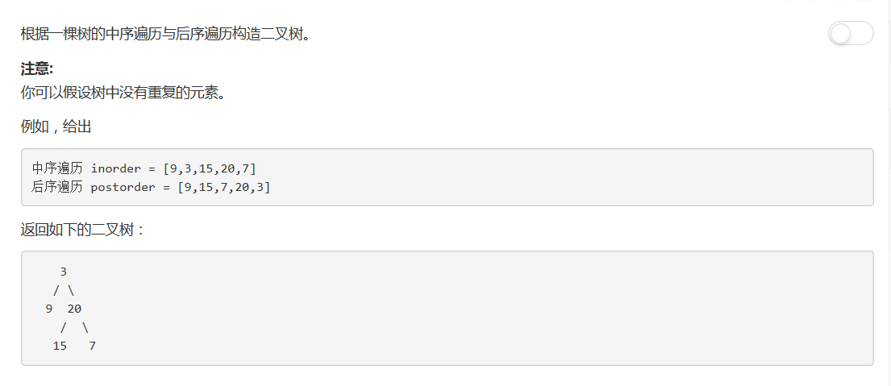

# 106 - 从中序与后序遍历序列构造二叉树
## 题目描述


>关联题目： [105. 从前序与中序遍历序列构造二叉树](https://github.com/Rosevil1874/LeetCode/tree/master/Python-Solution/105_Construct-Binary-Tree-from-Preorder-and-Inorder-Traversal)

## 构造原理
### 1. 遍历算法
1. 前序遍历： 先是根结点，再前序遍历左子树，再前序遍历右子树。
2. 中序遍历： 先中序遍历左子树，再是根结点，再是中序遍历右子树。
3. 后序遍历： 先后序遍历左子树，再是后序遍历右子树，再是根结点。

### 2. 构造二叉树
1. 前序 + 中序
    - 由遍历规则可知，前序遍历的第一个结点为树的根结点。而中序遍历中，以根结点为分界点，左边是左子树结点，右边是右子树结点。
    - 前序遍历的第二个结点为左子树的根结点。以这个结点为分界点，其左边为左子树的左子树结点，右边一直到根结点前一个结点为左子树的右子树结点。
    - 前序遍历的第三个结点为右子树的根结点。以这个结点为分界点，从根结点后一个结点分界点前为右子树的左子树结点，其右边一直到最后一个结点为右子树的右子树结点。
    - 以此类推。。。直到遍历完前序遍历序列，中序也同时遍历完了，二叉树也构建起来了哈哈哈＼＼\٩('ω')و//／／

2. 中序 + 后序
    - 由遍历规则可知，后序遍历的最后一个结点为树的根结点。而中序遍历中，以根结点为分界点，左边是左子树结点，右边是右子树结点。
    - 前序遍历的倒数第二个结点为右子树的根结点。以这个结点为分界点，从根结点后一个结点分界点前为右子树的左子树结点，其右边一直到最后一个结点为右子树的右子树结点。
    - 前序遍历的倒数第三个结点为左子树的根结点。以这个结点为分界点，其左边为左子树的左子树结点，右边一直到根结点前一个结点为左子树的右子树结点。
    - 以此类推。。。直到遍历完后序遍历序列，中序也同时遍历完了，二叉树也构建起来了哈哈哈＼＼\٩('ω')و//／／

## 一、递归
```python
# Definition for a binary tree node.
# class TreeNode(object):
#     def __init__(self, x):
#         self.val = x
#         self.left = None
#         self.right = None

class Solution(object):
    def buildTree(self, inorder, postorder):
        """
        :type inorder: List[int]
        :type postorder: List[int]
        :rtype: TreeNode
        """
        return self.helper(0, len(postorder) - 1, 0, len(inorder) - 1, postorder, inorder)

    def helper(self, postStart, postEnd, inStart, inEnd, postorder, inorder):
        if postStart > postEnd:
            return None

        root = TreeNode(postorder[postEnd])
        inIdx = 0           # 当前inorder中的根结点下标
        for i in range(inStart, inEnd + 1):     # 不能在切片数组中使用index确定下标，因为这样下标就是从0开始而不是在[inStart, inEnd]这个范围内了
            if inorder[i] == root.val:
                inIdx = i;
        root.right = self.helper(postEnd - inEnd + inIdx, postEnd - 1, inIdx + 1, inEnd, postorder, inorder)
        root.left = self.helper(postStart, postStart + inIdx - inStart - 1, inStart, inIdx - 1, postorder, inorder)        
        return root
```

## 二、简版递归

```python
# Definition for a binary tree node.
# class TreeNode(object):
#     def __init__(self, x):
#         self.val = x
#         self.left = None
#         self.right = None

class Solution(object):
    def buildTree(self, inorder, postorder):
        """
        :type inorder: List[int]
        :type postorder: List[int]
        :rtype: TreeNode
        """
        if not inorder or not postorder:
            return None

        root = TreeNode(postorder.pop())
        inIdx = inorder.index(root.val)

        root.right = self.buildTree(inorder[inIdx + 1:], postorder)
        root.left = self.buildTree(inorder[:inIdx], postorder)

        return root
```