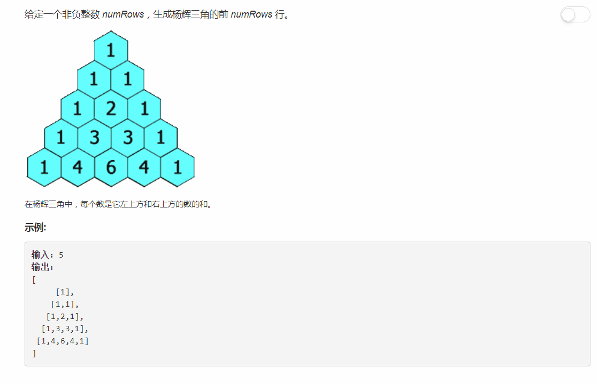
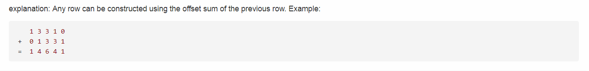

# 118 - 杨辉三角

## 题目描述


>关联题目： [119. 杨辉三角 II](https://github.com/Rosevil1874/LeetCode/tree/master/Python-Solution/119_Pascal's-Triangle-II)

## 解法一
思路：  
emmm就是老老实实按照杨辉三角的构造规则构造一个( ･´ω\`･)  


```python
class Solution:
    def generate(self, numRows: int) -> List[List[int]]:
        res = []
        if numRows == 0:
            return res
        for i in range(1, numRows + 1):
            row = [1] * i
            if i > 2:
                for j in range(1, i - 1):
                    row[j] = res[i - 2][j - 1] + res[i - 2][j]
            res.append(row)
        return res            
```

## 解法二
>cr: [Python 4 lines short solution using map.](https://leetcode.com/problems/pascals-triangle/discuss/38128/Python-4-lines-short-solution-using-map.)
厉害了，我找了半天规律也只能从等差数列的思路下手，人家把数组一错开就OK了(눈‸눈)  


思路：下一行 = 上一行数组 + 上一行数组错开一位的数组（向后平移一位）

```python
class Solution:
    def generate(self, numRows: int) -> List[List[int]]:
        if numRows == 0:
            return []
        res = [[1]]
        for i in range(1, numRows):
            pre = res[-1]
            curr = list(map(lambda x, y: x + y, pre + [0], [0] + pre))
            res.append(curr)
        return res            
```