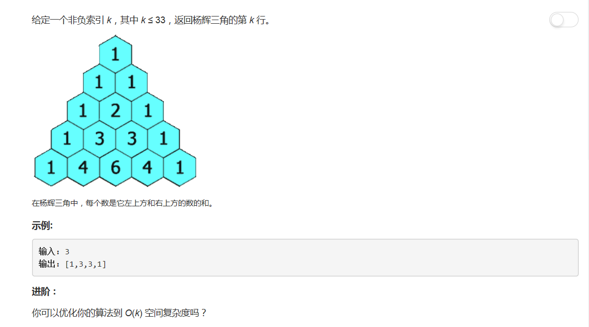

# 119 - 杨辉三角II

## 题目描述


>关联题目： [118. 杨辉三角 ](https://github.com/Rosevil1874/LeetCode/tree/master/Python-Solution/119_Pascal's-Triangle)

## 解法一
**空间复杂度O(k^2)** 
思路：  
emmm就是老老实实按照杨辉三角的构造规则构造一整个，然后返回最后一行( ･´ω\`･)  

```python
class Solution(object):
    def getRow(self, rowIndex):
        """
        :type rowIndex: int
        :rtype: List[int]
        """
        ret = []
        for i in range(rowIndex + 1):
            nums = [1] * (i + 1)
            if i >= 2:
                for j in range(1, i):
                    nums[j] = ret[i - 1][j - 1] + ret[i - 1][j]
            ret.append(nums)
        return ret[-1]
```

## 解法二
**空间复杂度O(k)** 


```python
class Solution(object):
    def getRow(self, rowIndex):
        """
        :type rowIndex: int
        :rtype: List[int]
        """
        ret = [1]
        for i in range(1, rowIndex + 1):
            ret = list( map(lambda x,y: x + y, [0] + ret, ret + [0]) )
        return ret
```