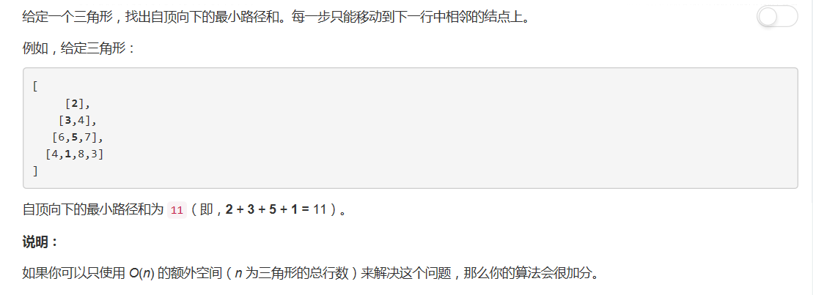
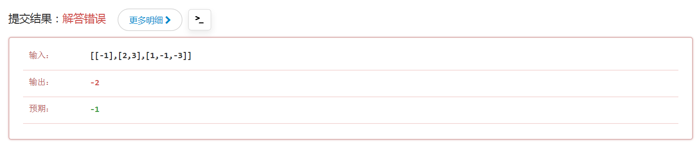

# 120 - 三角形最小路径和

## 题目描述


## 一、傻傻乱解题
思路：  
直接遍历二维数组，找出每个一维数组中的最小值之和。
```python
class Solution(object):
    def minimumTotal(self, triangle):
        """
        :type triangle: List[List[int]]
        :rtype: int
        """
        s = 0
        for nums in triangle:
            s += min(nums)
        return s
```
但是！出错了。。。

敢问这个预期的`-1`是怎么得来的，难道我对这道题有什么误解_(°ω°｣∠)_
哦是的，**每一步只能移动到下一行中相邻的结点上**，智障如我啊，我说怎么人家要用动态规划呢༼༎ຶᴗ༎ຶ༽

## 二、动态规划
三角形自底向上的动态规划: [DP Solution for Triangle](https://leetcode.com/problems/triangle/discuss/38730/DP-Solution-for-Triangle)
思路：  
1. 使用minLen来保存一层中每个点到最底层的最小路径长度，初始化为最底层数组（到自身的最短路径为其本身）；
2. 从倒数第二层开始，计算这一层中每个点到最后一层的最短路径长度，由于只能到达相邻结点，所以DP方程为`minpath[i] = min( minpath[i], minpath[i+1]) + triangle[k][i]`
3. 当到达最顶层时，整个三角形最短路径就求出来了，保存在minLen[0]中。
```python
class Solution(object):
    def minimumTotal(self, triangle):
        """
        :type triangle: List[List[int]]
        :rtype: int
        """
        minLen = triangle[-1]
        layer = len(triangle) - 2
        while layer >= 0:
            for i in range(layer + 1):
                minLen[i] = min(minLen[i], minLen[i + 1])+ triangle[layer][i]
            layer -= 1
        return minLen[0]
```