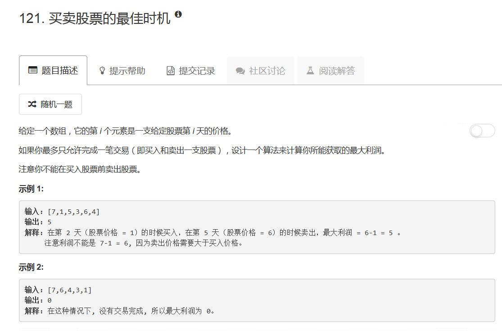
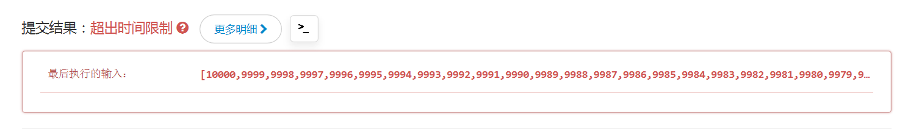

# 121 - 买卖股票的最佳时机

## 题目描述


>关联题目：  
- [122. 买卖股票的最佳时机II](https://github.com/Rosevil1874/LeetCode/tree/master/Python-Solution/122_Best-Time-to-Buy-and-Sell-Stock-II)
- [123. 买卖股票的最佳时机III](https://github.com/Rosevil1874/LeetCode/tree/master/Python-Solution/123_Best-Time-to-Buy-and-Sell-Stock-III)
- [188. 买卖股票的最佳时机IV](https://github.com/Rosevil1874/LeetCode/tree/master/Python-Solution/188_Best-Time-to-Buy-and-Sell-Stock-IV)
- [309. 买卖股票的最佳时机含冷冻期](https://github.com/Rosevil1874/LeetCode/tree/master/Python-Solution/309_Best-Time-to-Buy-and-Sell-Stock-with-Cooldown)
- [714. 买卖股票的最佳时机含手续费](https://github.com/Rosevil1874/LeetCode/tree/master/Python-Solution/714_Best-Time-to-Buy-and-Sell-Stock-with-Transaction-Fee)

>审题：  
根据题意，我们要求的其实就是数组中两个数的最大差值，要求大的数在后面。若数组后面没有比前面大的数，返回0.

## 一、暴力。。
**空间复杂度O(n^2)** 
思路：  
像我这种老实人（笨蛋）看到这题一般就立马写一个暴力搜索的双重循环，不超时才怪嘞(T ^ T) 

```python
class Solution(object):
    def maxProfit(self, prices):
        """
        :type prices: List[int]
        :rtype: int
        """
        maxP = 0
        for i in range(len(prices)):
        	j = i + 1
        	while j < len(prices):
        		maxP = max(maxP, prices[j] - prices[i])
        		j += 1
        return maxP
```



## 二、DP
**时间复杂度O(n)，空间复杂度O(n)**   

>瞄了一眼相关topic，发现有动态规划，于是乎~~

思路：  
1. dp[i]: 第i天的最大收益；
2. 第i+1天的最大收益为：
	- dp[i]，if prices[i+1] < minimum price before
	- max( dp[i], prices[i + 1] - minimum price before )，if prices[i+1] > minimum price before

```python
class Solution:
    def maxProfit(self, prices: List[int]) -> int:
        n = len(prices)
        if n == 0:
            return 0
        
        min_price = prices[0]
        dp = [0] * n
        
        for i in range(1, n):
            dp[i] = max(dp[i - 1], prices[i] - min_price)
            min_price = min(min_price, prices[i])
        
        return dp[n - 1]
```


## 三、DP变形
**时间复杂度O(n)，空间复杂度O(1)**   

解法二中其实有不必要的空间使用，即用于DP的数组，其实只需要使用一个变量来代替就行了。

> Runtime: 60 ms, faster than 92.17% of Python3 online submissions

```python
class Solution:
    def maxProfit(self, prices: List[int]) -> int:
        if not prices:
            return 0
        
        min_price = float('inf')
        max_profit = 0
        
        for p in prices:
            min_price = min(min_price, p)
            max_profit = max(max_profit, p - min_price)
            
        return max_profit
        
```