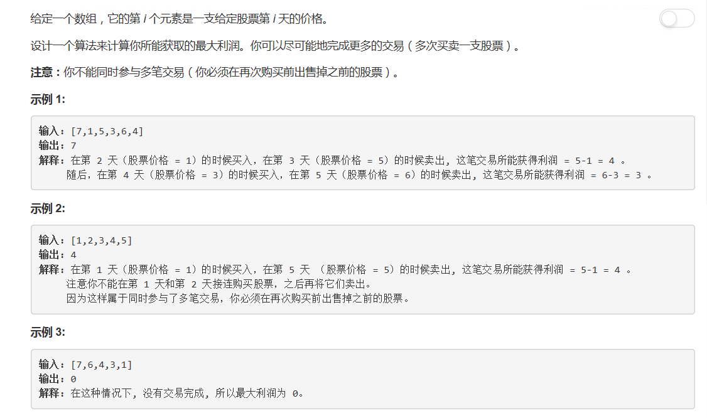
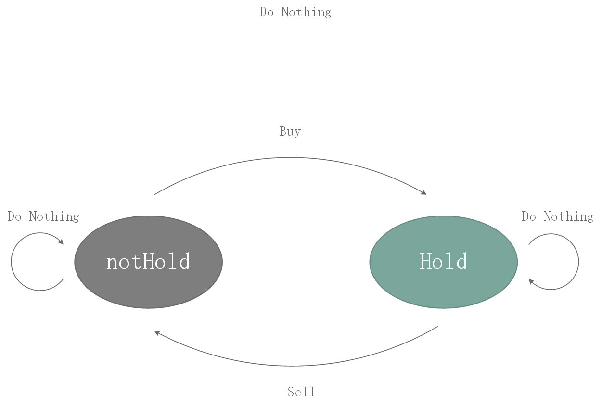

# 122 - 买卖股票的最佳时机II

## 题目描述


>关联题目：  
- [121. 买卖股票的最佳时机](https://github.com/Rosevil1874/LeetCode/tree/master/Python-Solution/121_Best-Time-to-Buy-and-Sell-Stock)
- [123. 买卖股票的最佳时机III](https://github.com/Rosevil1874/LeetCode/tree/master/Python-Solution/123_Best-Time-to-Buy-and-Sell-Stock-III)
- [188. 买卖股票的最佳时机IV](https://github.com/Rosevil1874/LeetCode/tree/master/Python-Solution/188_Best-Time-to-Buy-and-Sell-Stock-IV)
- [309. 买卖股票的最佳时机含冷冻期](https://github.com/Rosevil1874/LeetCode/tree/master/Python-Solution/309_Best-Time-to-Buy-and-Sell-Stock-with-Cooldown)
- [714. 买卖股票的最佳时机含手续费](https://github.com/Rosevil1874/LeetCode/tree/master/Python-Solution/714_Best-Time-to-Buy-and-Sell-Stock-with-Transaction-Fee)

>审题：  
此题与[121. 买卖股票的最佳时机](https://github.com/Rosevil1874/LeetCode/tree/master/Python-Solution/121_Best-Time-to-Buy-and-Sell-Stock)的区别在于：  
上一题要求只进行一次交易，此题要尽可能完成多的交易来获取最大利润。

## 解法一
思路：  
1. 中心思想就是：只要后面的价格下跌就赶紧卖了（哇要是买股票的时候真的能知道后面的走势就暴富了哇同志们！！！）；
2. 维护一个价格上升前的最低价格，在这个时候买入；
3. 若发现价格下跌，就在下跌前转卖。

```python
class Solution:
    def maxProfit(self, prices: List[int]) -> int:
        n = len(prices)
        if n == 0:
            return 0
        
        max_profit = 0
        prev_min = prices[0]
        for i in range(1, n):
            if prices[i] < prices[i - 1]:
                max_profit += prices[i - 1] - prev_min
                prev_min = prices[i]
            prev_min = min(prev_min, prices[i])
            
        if prices[n - 1] > prev_min:
            max_profit += prices[n - 1] - prev_min
            
        return max_profit
```

## 解法二
思路：  
这个同学没有严格按照交易的逻辑，而是只要后面的价格比较高就累加累加，得出的结果是一样的。  cr: [Is this question a joke?](https://leetcode.com/problems/best-time-to-buy-and-sell-stock-ii/discuss/39402/Is-this-question-a-joke) (感觉出题人的智商被嘲笑了 XD )

```python
class Solution:
    def maxProfit(self, prices: List[int]) -> int:
        n = len(prices)
        max_profit = 0
        for i in range(1, n):
            if prices[i] > prices[i - 1]:
                max_profit += prices[i] - prices[i - 1]
        return max_profit
```

## 解法三、动态规划
状态图：


```python
class Solution(object):
    def maxProfit(self, prices: List[int]) -> int:
        not_hold = 0                      # 开始状态  
        hold = float('-inf')             # 不可能一开始就持有股票   
        for p in prices:
            hold = max(hold, not_hold - p)        # 一直持有股票或买了股票
            not_hold = max(not_hold, hold + p)     # 一直未持有股票或卖了股票
        return not_hold
```