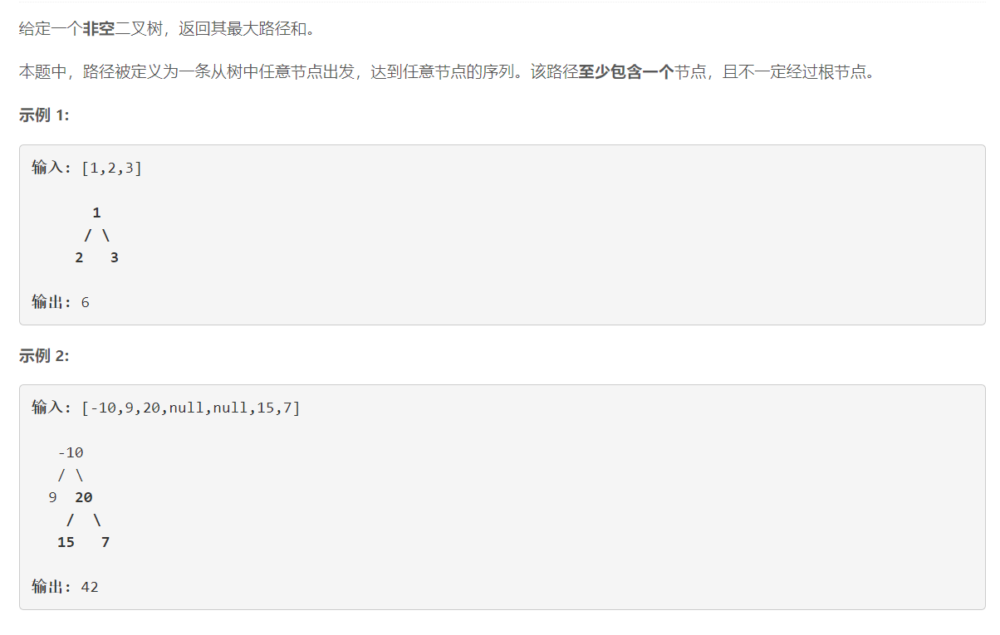

# 124 - 二叉树中的最大路径和

## 题目描述



## 递归
思路： 最长路径 = 最长左子路径 + 最长右子路径

```python
# Definition for a binary tree node.
# class TreeNode:
#     def __init__(self, x):
#         self.val = x
#         self.left = None
#         self.right = None

class Solution:
    def maxPathSum(self, root: TreeNode) -> int:
        if root is None:
        	return 0

        # 数组才能作为参数传到函数中并修改，否则传递的是一个拷贝
        max_path = [root.val]
        self.findMax(root, max_path)
        return max_path[0]

    def findMax(self, root, max_path):
    	if root is None:
    		return 0

    	# 计算左右子树的最长路径
    	# 左右子树最长路径分别和0比较，大于0就将此分支放在此路径上，否则剪枝
    	left_max = max(self.findMax(root.left, max_path), 0) 
    	right_max = max(self.findMax(root.right, max_path), 0)

    	# 计算以此节点作为根节点的子树的最长路径
    	max_path[0] = max( root.val + left_max + right_max, max_path[0] )

    	# 返回左右子路径中较长的一个，否则不构成路径
    	return root.val + max(left_max, right_max)


```