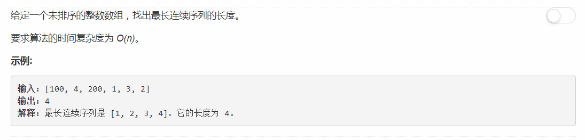

# 128 - 最长连续序列

## 题目描述


## 并查集
>有个超可爱的并查集文章哈哈 -> [超有爱的并查集~](https://blog.csdn.net/niushuai666/article/details/6662911)

并查集是一种支持合并集合和查找集合的一种数据结构

## 题解
**时间复杂度O(N)**
>参考StefanPochmann的[Simple O(n) with Explanation - Just walk each streak](https://leetcode.com/problems/longest-consecutive-sequence/discuss/41057/Simple-O(n)-with-Explanation-Just-walk-each-streak)

思路：  
1. 把数组装进set，这里的时间复杂度为O(N)，后面在set中查找就直接O(1)了；
2. 对集合set中的每个元素x，判断其是否为一个连续序列的开端(只要x-1不在集合中就是开端)；
3. 对每一个作为新序列开端的元素，依次查找x+1, x+2...是否在集合中，在的话就接在序列后，直到某个x+m不在集合中，说明序列断掉了，更新最长连续序列长度。

```python
class Solution:
    def longestConsecutive(self, nums):
        """
        :type nums: List[int]
        :rtype: int
        """
        maxLen = 0
        nums = set(nums)
        for x in nums:
            if x - 1 not in nums:
                y = x + 1
                while y in nums:
                    y += 1
                maxLen = max(maxLen, y - x)
        return maxLen
```

<hr>

**关于StefanPochmann**  
这哥们儿的头像我在discuss区前排都看眼熟了，主要是他用python我就老是去借鉴哈哈哈，来放个头像：  

好奇进了主页，高中开始编程，毕业于德国一个非常666的理工大学Technische Universität Darmstadt（达姆施塔特工业大学），可以说是一样666了。  
解魔方秒秒钟的事儿，单手/蒙眼也是秒秒钟的事儿。。。拿了8种不同类型的魔方的20个官方世界纪录，以及3个魔方世界冠军。。。  
还会杂耍，扔球球那种。。。