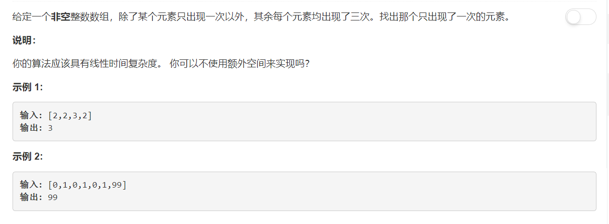

# 137 - 只出现一次的数字 II

## 题目描述


>关联题目： 
[136. 只出现一次的数字](https://github.com/Rosevil1874/LeetCode/tree/master/Python-Solution/136_Single-Number)
[260. 只出现一次的数字 III](https://github.com/Rosevil1874/LeetCode/tree/master/Python-Solution/260_Single-Number-III)


>审题：
出题人贴心给了两个小建议（还是小要求？）：  
1. 线性时间复杂度；
2. 不使用额外空间。  
线性时间复杂度倒容易满足，不使用额外空间就得想想了，毕竟要是可以用的话直接上collections.Counter就可以了哇。

## 题解一
相关话题里仍然是位运算，但是这次除了single number都出现了3次，异或行不通了呀，想不到怎么办就打算去discuss区抄答案o_o ....然鹅，一大篇英文解释让我觉得我没有抄答案的资格o_o ....幸好找到一位勤奋的小伙伴翻译了一下哈哈，那我就搬运吧：[Leetcode Single Number 问题总结](http://liadbiz.github.io/leetcode-single-number-problems-summary/)  

emmm...最后没看懂，又找了一个很拽的朋友的solution：[Challenge me , thx](https://leetcode.com/problems/single-number-ii/discuss/43294/Challenge-me-thx)，虽然他自己没有给解释，但是下面好多厉害的热心观众给了explanation:

1. 使用bits来表示状态，这里最多出现3次则每个数字共对应有3种状态，使用两位的二进制就可以表示了：00（出现0次）、01（出现1次）、10（出现2次）、00（出现3次）；
2. For 'ones', we can get 'ones = ones ^ A[i]; if (twos == 1) then ones = 0', that can be tansformed to 'ones = (ones ^ A[i]) & ~twos'.
3. Similarly, for 'twos', we can get 'twos = twos ^ A[i]; if (ones* == 1) then twos = 0' and 'twos = (twos ^ A[i]) & ~ones'. Notice that 'ones*' is the value of 'ones' after calculation, that is why twos is calculated later.
4. 另外一个直观解释：


```python
class Solution(object):
    def singleNumber(self, nums):
        """
        :type nums: List[int]
        :rtype: int
        """
        single = 0
        for x in nums:
        	single ^= x
        return single
```

## 题解二
利用set的元素唯一的性质，这个方法很好用啊，不管出现几次都轻松解决哈哈哈。

```python
class Solution(object):
    def singleNumber(self, nums):
        """
        :type nums: List[int]
        :rtype: int
        """
        return ( 3*sum(set(nums)) - sum(nums) ) // 2
```
