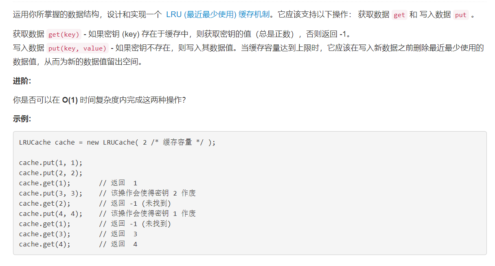

# 146 - LRU缓存机制

## 题目描述


>关联题目： [460. LFU缓存](https://github.com/Rosevil1874/LeetCode/tree/master/Python-Solution/460_LFU-Cache)  


## 题解一：【OrderedDict】
**思路：**
1. collections.OrderedDict():可以记住内容添加顺序的字典。  特殊方法：OrderedDict.popitem(last=True) 。last为True是LIFO,即为堆栈，反之是FIFO，即为队列；
2. 不管get还是set之后，操作的这个元素都要拿出来重新放进去，表示现在使用了它；

>两个操作时间复杂度都是O(1)哟~

```python
import collections
class LRUCache(object):

    def __init__(self, capacity):
        """
        :type capacity: int
        """
        self.remain = capacity
        self.cache = collections.OrderedDict()
        

    def get(self, key):
        """
        :type key: int
        :rtype: int
        """
        if key not in self.cache:
            return -1
        value = self.cache.pop(key)
        self.cache[key] = value
        return value


    def put(self, key, value):
        """
        :type key: int
        :type value: int
        :rtype: None
        """
        # 若这个key已经在缓存中了，为了“使用”它一次，要把它拿出来重新放进去，表示最近使用
        if key in self.cache:
            self.cache.pop(key)
        # 否则：
        else:
            # 若缓存未满，这个key将占用一个缓存位置
            if self.remain > 0:
                self.remain -= 1
            # 若缓存满了，将最近最少使用的元素移除，为新key腾出空间
            else:
                self.cache.popitem(last = False)
        self.cache[key] = value
```


## 题解二：【dict + deque】
然鹅，有人评论说在这道题用OrderedDict就是trick，不过我很开心又学了新知识嘻嘻。好啦，下面有老老实实不trick的版本啦，其实就是吧OrderedDict拆开成deque和dictionary两部分来实现。不过根据文档，deque的remove时间复杂度是O(n)，不能达到让两个操作都是O(1)的时间复杂度。  

同理，用list代替deque实现也是可以哒。

```python

import collections
class LRUCache(object):

    def __init__(self, capacity):
        """
        :type capacity: int
        """
        self.capacity = capacity
        self.cache = collections.deque([])  # 用来存key，记住存放顺序
        self.dict = {}                      # 用来存key-value
        

    def get(self, key):
        """
        :type key: int
        :rtype: int
        """
        if key not in self.dict:
            return -1
        self.cache.remove(key)
        self.cache.append(key)
        return self.dict[key]


    def put(self, key, value):
        """
        :type key: int
        :type value: int
        :rtype: None
        """
        # 若这个key已经在缓存中了，为了“使用”它一次，要把它拿出来重新放进去，表示最近使用
        if key in self.cache:
            self.cache.remove(key)

        # 否则：若缓存满了，将最近最少使用的元素移除，为新key腾出空间。同时要将在dict中的记录也删去。
        elif len(self.cache) == self.capacity:
            v = self.cache.popleft()
            self.dict.pop(v)
        self.cache.append(key)
        self.dict[key] = value
```


其实有很多使用双链表的，这里放一个传送门就不复现了：[Python Dict + Double LinkedList](https://leetcode.com/problems/lru-cache/discuss/45926/Python-Dict-%2B-Double-LinkedList)