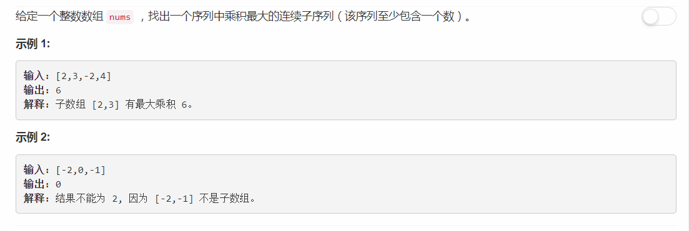

# 152 - 乘积最大子序列

## 题目描述


## 题解
参考： [Possibly simplest solution with O(n) time complexity](https://leetcode.com/problems/maximum-product-subarray/discuss/48230/Possibly-simplest-solution-with-O(n)-time-complexity)  
主要是要注意负数的情况。

```python
class Solution:
    def maxProduct(self, nums):
        """
        :type nums: List[int]
        :rtype: int
        """
        # 当前最大值
        currMax = nums[0]

        # imax/imin保存以nums[i]结尾的子数组的最大/最小乘积
        imax = imin = currMax
        for i in range(1, len(nums)):
            # 负数使小数更大，使大数更小
            if nums[i] < 0:
                imax, imin = imin, imax

            # 当前最大/最小乘积 = nums[i]本身 or nums[i]*最大/最小乘积
            imax = max(nums[i], imax * nums[i])
            imin = min(nums[i], imin * nums[i])

            currMax = max(currMax, imax)

        return currMax
```
