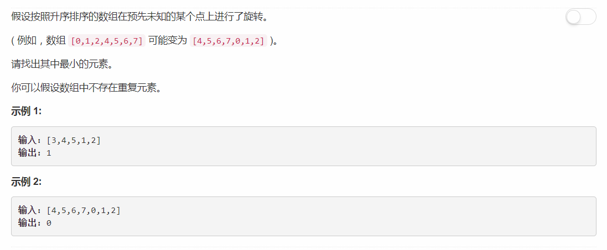

# 153 - 寻找旋转排序数组中的最小值

## 题目描述


>关联题目： [154. 寻找旋转排序数组中的最小值 II](https://github.com/Rosevil1874/LeetCode/tree/master/Python-Solution/154_Find-Minimum-in-Rotated-Sorted-Array-II)  

## 二分查找
1. 最小元素必定在旋转轴处；
2. 采用二分查找，若序列初始有序，则说明没有旋转，最小元素为第一个元素；
3. 若左右某子序列是有序的，则旋转点必定在另一个子序列中。

```python
class Solution:
    def findMin(self, nums):
        """
        :type nums: List[int]
        :rtype: int
        """
        left, right = 0, len(nums) - 1
        
        while left < right:
            if nums[left] < nums[right]:
                return nums[left]

            mid = (left + right) // 2
            if nums[left] <= nums[mid]:
                left = mid + 1
            else:
                right = mid
        return nums[left]
```
