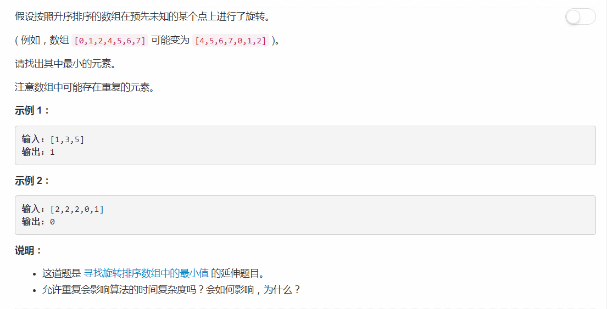

# 154 - 寻找旋转排序数组中的最小值 II

## 题目描述


>关联题目： [153. 寻找旋转排序数组中的最小值](https://github.com/Rosevil1874/LeetCode/tree/master/Python-Solution/153_Find-Minimum-in-Rotated-Sorted-Array)    
和上一题的区别在于可能有重复元素，所以思路和上一题基本一致，主要是处理重复元素。

## 二分查找
1. 最小元素必定在旋转轴处；
2. 采用二分查找，若序列初始有序，则说明没有旋转，最小元素为第一个元素；
3. 判断左右子序列的其中一个：
    - 若有序，则旋转点必定在另一个子序列中；
    - 若无序，则旋转点必定在当前子序列中；
    - 若子序列首尾元素相同，无法判断旋转点在哪部分中，则删掉一个端点处的重复元素以缩小范围（左子序列删头，右子序列删尾）。

```python
class Solution:
    def findMin(self, nums):
        """
        :type nums: List[int]
        :rtype: int
        """
        left, right = 0, len(nums) - 1
        
        while left < right:
            print(left, right)
            if nums[left] < nums[right]:
                return nums[left]

            mid = (left + right) // 2
            if nums[left] < nums[mid]:
                left = mid
            elif nums[left] > nums[mid]:
                right = mid
            elif nums[left] == nums[mid]:
                left += 1

        return nums[left]
```
