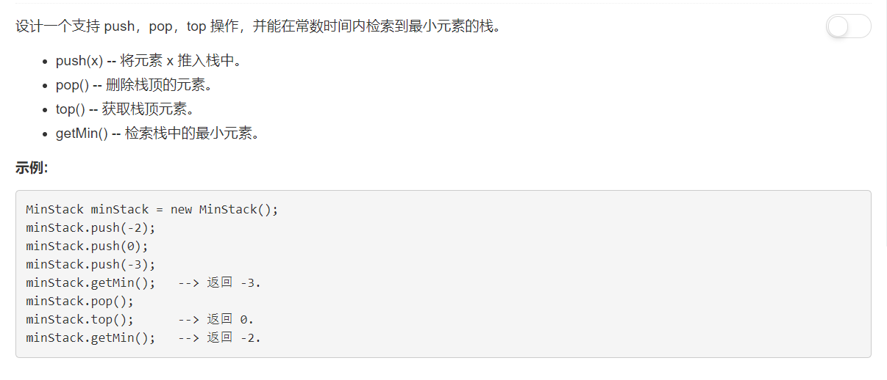

# 155 - 最小栈

## 题目描述


>关联题目： 716. 最大栈，emmmmm这题要开会员才能刷，穷人现在已经不配刷题了呜呜┭┮﹏┭┮

## 题解
**思路：** 
1. 使用数组模拟栈；
2. 这道题主要要解决的问题是返回栈中最小值，为了保证不影响push、pop等基本操作，需要将最小值存在额外的空间；
2. 使用数组的最后一个位置：s[-1][0]存放栈顶元素，s[-1][1]存放最小值。

```python
class MinStack(object):

    def __init__(self):
        """
        initialize your data structure here.
        """
        self.s = []

    def push(self, x):
        """
        :type x: int
        :rtype: None
        """
        # 将新加入的栈顶元素放在s[-1][0]，最小值放在s[-1][1]，这里的getMin就是自己实现的取最小值的函数。
        # 要判断栈为空的情况，否则getMin返回的是None
        self.s.append((x, x if not self.s else min(self.getMin(), x))) 
        

    def pop(self):
        """
        :rtype: None
        """
        self.s.pop()

    def top(self):
        """
        :rtype: int
        """
        return self.s[-1][0] if self.s else None

    def getMin(self):
        """
        :rtype: int
        """
        return self.s[-1][1] if self.s else None


# Your MinStack object will be instantiated and called as such:
# obj = MinStack()
# obj.push(x)
# obj.pop()
# param_3 = obj.top()
# param_4 = obj.getMin()
```
