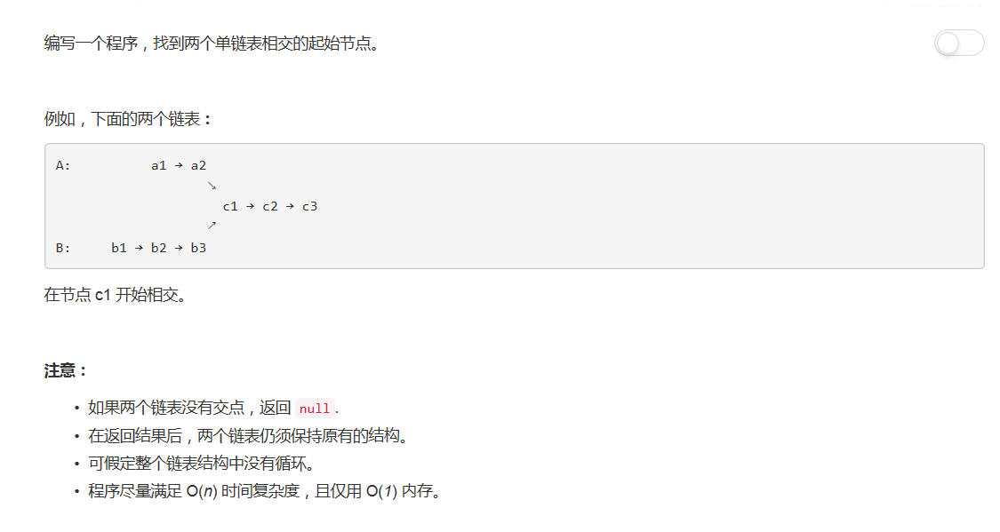

# 160 - 相交链表

## 题目描述


## 方法
1. 遍历两链表得到链表长度；
2. 特殊情况：由于求长度时要走到链表尾，这时可以比较两结点。若不相同可直接返回None；
3. 指针1在长链表中先前进链表长度差（lenA-lenB)步，这时两链表剩余长度相同；
4. 两指针同时前进直到找出相同结点并返回，或走完链表仍不同就返回None。

```python
# Definition for singly-linked list.
# class ListNode(object):
#     def __init__(self, x):
#         self.val = x
#         self.next = None

class Solution(object):
    def getIntersectionNode(self, headA, headB):
        """
        :type head1, head1: ListNode
        :rtype: ListNode
        """
        if not headA or not headB:
            return None

        # 求两链表长度
        p1 = headA
        p2 = headB
        lenA = 0
        lenB = 0
        while p1:
            lenA += 1
            p1 = p1.next
        while p2:
            lenB += 1
            p2 = p2.next

        # 判断链表长短
        diff = 0
        if lenA >= lenB:
            diff = lenA - lenB
            longL = headA
            shortL = headB
        else:
            diff = lenB - lenA
            longL = headB
            shortL = headA

        # 长链表先走diff步
        p1 = longL
        p2 = shortL
        while diff:
            p1 = p1.next
            diff -= 1

        # 两链表同时遍历
        while p2:
            if p1.val == p2.val:
                return p1
            p1 = p1.next
            p2 = p2.next
        return None
```
