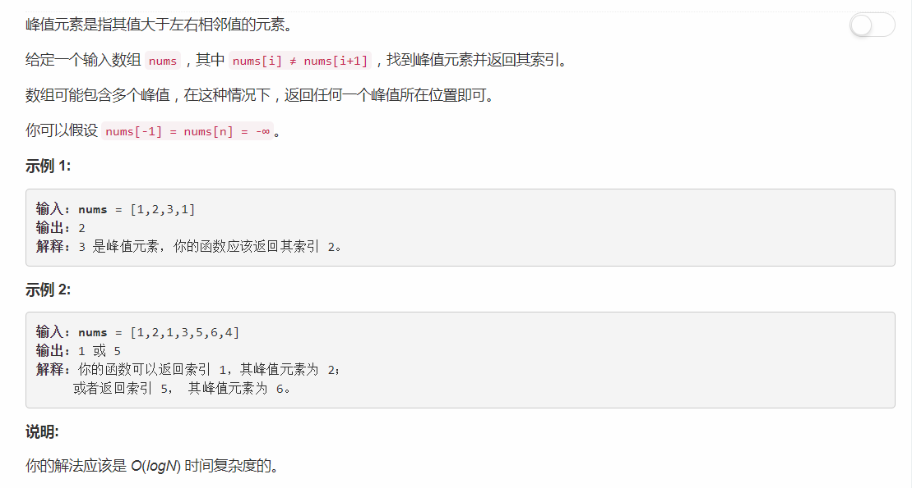

# 162 - 寻找峰值

## 题目描述


## 题解
**时间复杂度O(logN)**
>看到要求时间复杂度O(logN)就立马想到了binary search。

思路：  
寻找任意峰值就是寻找一个局部最大值，任意局部最大值的左边至少有一个元素比他小，右边有一个元素比他大（除了最大值在两端的情况）。那么在峰值左边有一个递增子序列，其右边有一个递减子序列，这样就有了两个有序序列。利用二分查找缩小范围，若nums[i - 1] > nums[i]，说明现在搜索的是峰值右边的递减序列，接下来应该缩小其左边序列的范围，重复直至收缩到峰值。

## 一、递归
```python
class Solution:
    def findPeakElement(self, nums: List[int]) -> int:
        return self.binary_search(nums, 0, len(nums) - 1)
    
    def binary_search(self, nums:List[int], l: int, r: int):
        if l == r:
            return l
        mid1 = (l + r) // 2
        mid2 = mid1 + 1
        if nums[mid1] > nums[mid2]:
            return self.binary_search(nums, l, mid1)
        else:
            return self.binary_search(nums, mid2, r)
```

## 二、迭代
**迭代1**
```python
class Solution:
    def findPeakElement(self, nums: List[int]) -> int:
        l, r = 0, len(nums) - 1
        while l < r - 1:
            mid = (l + r) // 2
            if nums[mid] > nums[mid - 1] and nums[mid] > nums[mid + 1]:
                return mid
            elif nums[mid] > nums[mid + 1]:
                r = mid - 1
            else:
                l = mid + 1
        return l if nums[l] >= nums[r] else r
```

**迭代2**
```python
class Solution:
    def findPeakElement(self, nums: List[int]) -> int:
        l, r = 0, len(nums) - 1
        while l < r:
            mid1 = (l + r) // 2
            mid2 = mid1 + 1
            if nums[mid1] > nums[mid2]:
                r = mid1
            else:
                l = mid2
        return l
```