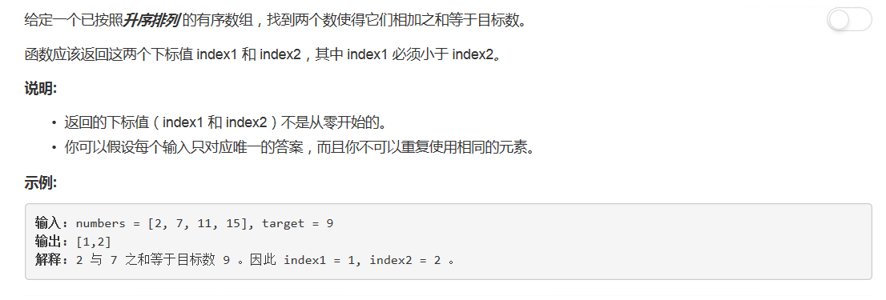

# 167 - 两数之和 II - 输入有序数组

## 题目描述


>相似题目[1.两数之和](https://github.com/Rosevil1874/LeetCode/tree/master/Python-Solution/1_Two_Sum)

## 一、字典
思路：  
1. 新建一个空的字典；
2. 遍历数组，检查diff = target - numbers[i]是否在字典中，是则说明找到了满足条件的元素对，返回diff和当前元素的位置；
3. 将当前元素及其下标作为键值对加入字典；
4. 若遍历结束还没有找到则返回空数组。
```python
class Solution(object):
    def twoSum(self, numbers, target):
        """
        :type numbers: List[int]
        :type target: int
        :rtype: List[int]
        """
        d = {}
        for i in range(len(numbers)):
            diff = target - numbers[i]
            if diff in d:
                return [d[diff], i + 1]
            d[numbers[i]] = i + 1
        return list(d)
```

## 二、双指针
思路：  
1. left，right指针分别指向数组头尾元素；
2. 若numbers[left] + numbers[right] == target则直接返回；
3. 若numbers[left] + numbers[right] < target则将left右移，前两个数的和会增大；
4. numbers[left] + numbers[right] > target则将right左移，前两个数的和会减小；
5. 两指针相遇时还未找到满足的元素对则返回空数组。
```python
class Solution(object):
    def twoSum(self, numbers, target):
        """
        :type numbers: List[int]
        :type target: int
        :rtype: List[int]
        """
        left, right = 0, len(numbers) - 1
        while left < right:
            if numbers[left] + numbers[right] == target:
                return [left + 1, right + 1]
            elif numbers[left] + numbers[right] < target:
                left += 1
            else:
                right -= 1
        return []
```