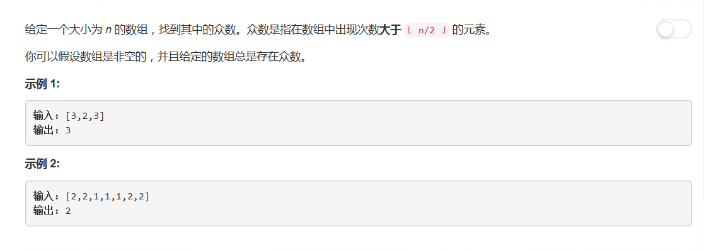
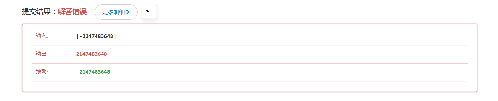
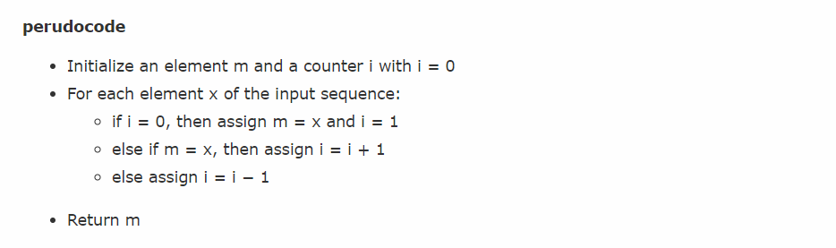

# 169 - 求众数

## 题目描述


>关联题目： [229. 求众数II](https://github.com/Rosevil1874/LeetCode/tree/master/Python-Solution/229_Majority-Element-II)

## 一、字典（hash)
**时间复杂度: O(n)**
思路：
使用set计算每个元素出现的次数，若出现次数**大于**`⌊ n/2 ⌋`则返回，无需考虑特殊情况。

> Runtime: 188 ms, faster than 66.46% of Python3 online submissions.  
Memory Usage: 14.1 MB, less than 100.00% of Python3 online submissions

```python
class Solution:
    def majorityElement(self, nums: List[int]) -> int:
        s = {}
        for x in nums:
            if x in s:
                s[x] += 1
            else:
                s[x] = 1
            if s[x] > len(nums) // 2:
                return x
```

使用collections.Counter()实现此方法：

>Runtime: 172 ms, faster than 93.63% of Python3 online submissions.  
Memory Usage: 14 MB, less than 100.00% of Python3 online submissions

```python
from collections import Counter
class Solution:
    def majorityElement(self, nums: List[int]) -> int:
        cnt = dict(Counter(nums))
        for k, v in cnt.items():
            if v > len(nums) // 2:
                return k
```

## 二、排序
**时间复杂度: O(n logn)**
思路：  
众数出现的次数大于`⌊ n/2 ⌋`，那么排序后数组的中位数一定是众数。  
没错又是一行代码( ･´ω\`･ )

> Runtime: 164 ms, faster than 99.19% of Python3 online submissions.  
Memory Usage: 13.9 MB, less than 100.00% of Python3 online submissions

```python
return sorted(nums)[len(nums)//2]
```


## 三、分治法
**时间复杂度: O(n logn)**
1. base case：只有一个元素时，这个元素就是众数；
2. 语法`element = [a, b][a < b]`相当于`element = b if a < b else a`；
3. 语法`list.count(obj)`：统计obj在list中出现的次数。

> 递归是真的慢：  
Runtime: 244 ms, faster than 5.00% of Python3 online submissions.  
Memory Usage: 13.9 MB, less than 100.00% of Python3 online submissions.

```python
class Solution(object):
    def majorityElement(self, nums):
        """
        :type nums: List[int]
        :rtype: int
        """
        if not nums:
        	return None
        if len(nums) == 1:
        	return nums[0]
        left = self.majorityElement(nums[:len(nums)//2])
        right = self.majorityElement(nums[len(nums)//2:])
        if left == right:
        	return left
        return [right, left][nums.count(left) > len(nums)//2]
```


## 四、位操作
**时间复杂度: O(n)**
思路：  
将众数按位来建立。将每个数看做32位的二进制数，从0到31位，对每个数字统计下该位上0和1的个数，如果这一位1的个数大于一半，说明众数中这一位是1，否则众数的这一位是0.
```python
class Solution(object):
    def majorityElement(self, nums):
        """
        :type nums: List[int]
        :rtype: int
        """
        n = len(nums)
        major = 0				# 众数
        mask = 1				# 掩码
        for i in range(32):		# 计算众数（32位二进制）的每一位
        	bitCounts = 0
        	for j in range(n):	# 对每个数进行位运算
        		if nums[j] & mask:		# 当前元素该位为1,1的个数+1
        			bitCounts += 1
        		if bitCounts > n//2:	# 该位1的个数大于一半，众数中该位为1
        			major |= mask
        			break
        	mask = mask << 1
        return major
```
不得不说这个方法简直秒！不过，代码可能有点瑕疵，负数的情况下出错了：


当一个32位二进制数的最高位为1时，代表此数为负数，加上负数情况处理后的代码：
> Runtime: 512 ms, faster than 5.00% of Python3 online submissions.  
Memory Usage: 13.9 MB, less than 100.00% of Python3 online submissions.

```python
class Solution(object):
    def majorityElement(self, nums: List[int]) -> int:
        n = len(nums)
        major = 0				# 众数
        mask = 1				# 掩码
        for i in range(32):		# 计算众数（32位二进制）的每一位
        	bitCounts = 0
        	for j in range(n):	# 对每个数进行位运算
        		if nums[j] & mask:		# 当前元素该位为1,1的个数+1
        			bitCounts += 1
        		if bitCounts > n//2:	# 该位1的个数大于一半，众数中该位为1
        			if i == 31:			# 第31位为1代表众数为负
        				major = -((1 << 31) - major)
        			else:
        				major |= mask
        			break
        	mask <<= 1
        return major
```


## 五、投票算法
**时间复杂度: O(n)**

思路：  
1. 两个变量candidate和count。candidate记录当前可能的候选众数，count保存该候选众数出现的次数。
2. 遍历数组nums：
	- 若当前元素与candidate相同，则计数count + 1；
	- 否则若count == 0则说明这个candidate不可能是众数了，将更新candidate为当前元素；
	- 否则count - 1。
3. 因为每一对不一样的数都会消掉，而众数的数量大于一半，所以最终留下的candidate即为“当选的”众数。

```python
candidate = nums[0]
cnt = 0
for i in range(1, len(nums)):
	if nums[i] == candidate:
		cnt += 1
	elif cnt == 0:
		candidate = nums[i]
	else:
		cnt -= 1
return candidate
```