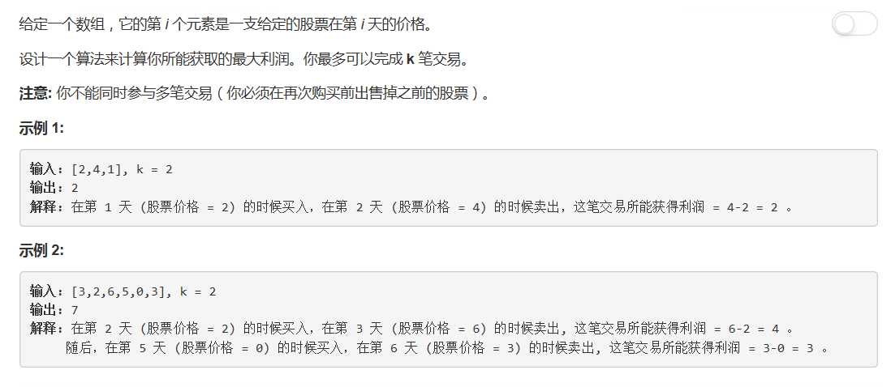

# 188 - 买卖股票的最佳时机III

## 题目描述


>关联题目：  
- [121. 买卖股票的最佳时机](https://github.com/Rosevil1874/LeetCode/tree/master/Python-Solution/121_Best-Time-to-Buy-and-Sell-Stock)
- [122. 买卖股票的最佳时机II](https://github.com/Rosevil1874/LeetCode/tree/master/Python-Solution/122_Best-Time-to-Buy-and-Sell-Stock-II)
- [123. 买卖股票的最佳时机III](https://github.com/Rosevil1874/LeetCode/tree/master/Python-Solution/123_Best-Time-to-Buy-and-Sell-Stock-III)
- [309. 买卖股票的最佳时机含冷冻期](https://github.com/Rosevil1874/LeetCode/tree/master/Python-Solution/309_Best-Time-to-Buy-and-Sell-Stock-with-Cooldown)
- [714. 买卖股票的最佳时机含手续费](https://github.com/Rosevil1874/LeetCode/tree/master/Python-Solution/714_Best-Time-to-Buy-and-Sell-Stock-with-Transaction-Fee)


## 动态规划
>cr: [Clean Java DP solution with comment](https://leetcode.com/problems/best-time-to-buy-and-sell-stock-iv/discuss/54117/Clean-Java-DP-solution-with-comment) 

思路：  
- p[i，j]: 进行到第j天时进行i个交易的最大利润。（0 <= i <= K，0 <= j <= len）
- p[0, j] = 0;
- p[i, 0] = 0;
- p[i, j] = max(p[i, j-1], p[i-1, prev] - prices[prev] + prices[j]);  【prev in range of [0, j-1] 】
          = max(p[i, j-1], max(p[i-1, prev] - prices[prev]))
- 若k > len//2，那么就可以随意交易啦。

```python
class Solution(object):
    def maxProfit(self, k, prices):
        """
        :type k: int
        :type prices: List[int]
        :rtype: int
        """
        n = len(prices)
        if k >= n // 2:
            return self.quickSolve(prices)

        p = [ [0] * n for i in range(k + 1) ]
        for i in range(1, k + 1):
            tmpMax = -prices[0]
            for j in range(1, n):
                p[i][j] = max(p[i][j - 1], prices[j] + tmpMax)
                tmpMax = max(tmpMax, p[i][j] - prices[j])
        return p[k][n - 1]

    def quickSolve(self, prices):
        n = len(prices)
        profit = 0
        for i in range(1, n):
            if prices[i] > prices[i - 1]:
                profit += prices[i] - prices[i - 1]
        return profit
```