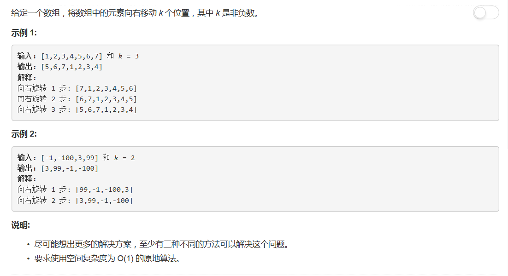

# 189 - 旋转数组

## 题目描述


## 一、旋转
思路：  
把数组末尾的k个元素一个个删除插到头部

```python
class Solution(object):
    def rotate(self, nums, k):
        """
        :type nums: List[int]
        :type k: int
        :rtype: void Do not return anything, modify nums in-place instead.
        """
        for i in range(k):
            nums[0:0] = [nums.pop()]
```

## 二、反转
思路：  
先把数组前半部分reverse，然后后半部分reverse，再整个reverse。

```python
class Solution(object):
    def rotate(self, nums, k):
        """
        :type nums: List[int]
        :type k: int
        :rtype: void Do not return anything, modify nums in-place instead.
        """
        if k == 0:
            return
            
        k, end = k % len(nums), len(nums) - 1
        self.reverse(nums, 0, end - k)
        self.reverse(nums, end - k + 1, end)
        self.reverse(nums, 0, end)
        
    def reverse(self, nums, start, end):
        while start < end:
            nums[start], nums[end] = nums[end], nums[start]
            start, end = start + 1, end - 1
```