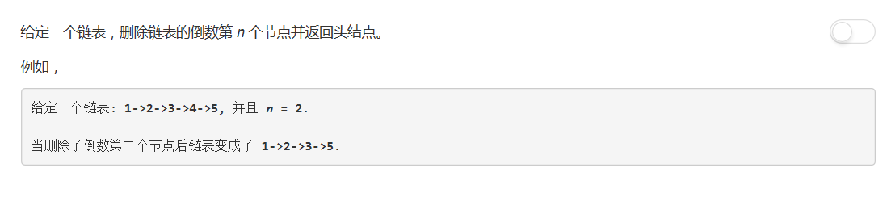

# 19 - 删除链表的倒数第N个节点


## 题目描述


## 方法
思路一：
1. 首先，要删除的是**倒数**第N个结点，单链表只能从前往后遍历，这样就要求知道链表一共有多少个结点；
2. 知道链表一共有多少个结点的方法就是先遍历一遍；
3. 这样的话要删除某个结点需要再跟着链表往后走一遍，去删除目标结点；
4. 遍历两边，不妙不妙啊(ó﹏ò｡)

思路二：
1. 使用两个指针，一快一慢；
2. 快的比慢的快N个结点；
3. 当快的到达尾部的时候，慢的正好指向目标结点的pre结点，只需要轻轻跳过它就Okey-dokey yo!
4. 遍历一遍，妙哉妙哉(｡◕ˇ∀ˇ◕)

```python
# Definition for singly-linked list.
# class ListNode:
#     def __init__(self, x):
#         self.val = x
#         self.next = None

class Solution:
    def removeNthFromEnd(self, head: ListNode, n: int) -> ListNode:
        if not head:
            return None
        
        # fast先前进n步
        fast = head
        for _ in range(n):
            fast = fast.next
            
        # 若n等于链表长度时fast会移动到最后的None，此时删除第一个结点
        if not fast:
            return head.next
        
        # 两指针同时前进，fast到达尾部时slow指向待删结点前一个结点
        slow = head
        while fast.next:
            slow = slow.next
            fast = fast.next
        slow.next = slow.next.next
        return head
```