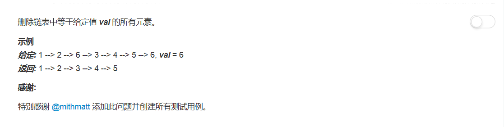

## 题目描述


<!-- more -->

## 方法
emmm就是一个基本的链表元素删除操作呀

```python
# Definition for singly-linked list.
# class ListNode(object):
#     def __init__(self, x):
#         self.val = x
#         self.next = None

class Solution(object):
    def removeElements(self, head, val):
        """
        :type head: ListNode
        :type val: int
        :rtype: ListNode
        """
        if not head:
            return None

        dummy = ListNode(None)
        dummy.next = head
        prev = dummy
        curr = head

        while curr:
            if curr.val == val:
                prev.next = curr.next
                curr = prev.next
            else:
                prev = prev.next
                curr = curr.next
        return dummy.next
```