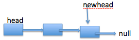
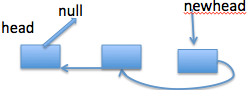

# 206 - 反转链表

## 题目描述
Reverse a singly linked list.

**Example:**
	Input: 1->2->3->4->5->NULL
	Output: 5->4->3->2->1->NULL
**Follow up:**
A linked list can be reversed either iteratively or recursively. Could you implement both?

>审题：
1. 原地反转一个单链表；
2. 使用迭代和递归两种方法。


## 迭代
头插法：向后遍历，依次将结点插到第一个结点前。

> Runtime: 32 ms, faster than 88.39% of Python3 online submissions.  
Memory Usage: 13.9 MB, less than 100.00% of Python3 online submissions

```python
# Definition for singly-linked list.
# class ListNode:
#     def __init__(self, x):
#         self.val = x
#         self.next = None

class Solution:
    def reverseList(self, head: ListNode) -> ListNode:
        if not head or not head.next:
            return head
        
        curr = head
        while curr.next:
            temp = ListNode(curr.next.val)
            temp.next = head
            head = temp
            curr.next = curr.next.next
        return head
```


## 递归
>cr:[全面分析再动手的习惯：链表的反转问题（递归和非递归方式）](http://www.cnblogs.com/kubixuesheng/p/4394509.html)
思路：
1. 递归先走到链表末端；

2. 更新每个结点的next值，即将指针反向；

3. 每个指针反向就链表反转了。


>Runtime: 28 ms, faster than 96.47% of Python3 online submissions.  
Memory Usage: 17.3 MB, less than 22.73% of Python3 online submissions

```python
# Definition for singly-linked list.
# class ListNode:
#     def __init__(self, x):
#         self.val = x
#         self.next = None

class Solution:
    def reverseList(self, head: ListNode) -> ListNode:
        if not head or not head.next:
            return head
        
        # 递归：从前向后走到链表末端
        new_head = self.reverseList(head.next)
        
        # 递归收回阶段：从后往前依次(head从倒数第二个节点开始往前遍历)
        # 指针反向：将前置结点设为后结点的后置结点
        head.next.next = head
        head.next = None
        
        return new_head
```