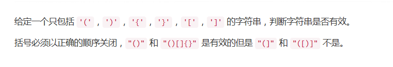

## 题目描述


<!-- more -->

## 方法
数据结构经典题，用栈完美解决。
```python
class Solution:
    def isValid(self, s):
        """
        :type s: str
        :rtype: bool
        """

        if s is None:
        	return false

        x = ['[','(','{']
        y = ["]",")","}"]
        z = ["()","[]","{}"]

        stack = []
        for char in s:
        	if char in x:
        		stack.append(char)
        	elif char in y:
        		if len(stack) == 0:
        			return False
        		else:
        			temp = stack.pop(-1) + char
        			if temp not in z:
        				return False
        if len(stack) != 0:
        	return False	
        return True
```