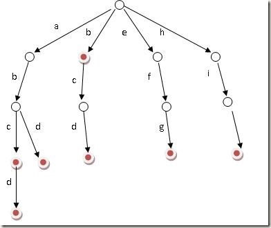

# 212 - 单词搜索II

## 题目描述


>关联题目： [79. 单词搜索](https://github.com/Rosevil1874/LeetCode/tree/master/Python-Solution/79_Word-Search)  
>知识点： [BFS & DFS](https://github.com/Rosevil1874/LeetCode/tree/master/Summary/BFS & DFS)， [Trie-前缀树](http://www.cnblogs.com/luosongchao/archive/2013/08/05/3239521.html)

## Trie树构建

1、插入过程
对于一个单词，从根开始，沿着单词的各个字母所对应的树中的节点分支向下走，直到单词遍历完，将最后的节点标记为红色，表示该单词已插入Trie树。
2、查询过程
同样的，从根开始按照单词的字母顺序向下遍历trie树，一旦发现某个节点标记不存在或者单词遍历完成而最后的节点未标记为红色，则表示该单词不存在，若最后的节点标记为红色，表示该单词存在。

## DFS + 回溯 + Trie
>显然，出自大神之手，Trie都是现学的༼༎ຶᴗ༎ຶ༽

思路：
1. 遍历矩阵，分别以每一个元素为起点开始深度遍历；
2. 若索引超出范围，返回False；
3. 若当前元素在Trie树中匹配，则将当前元素标记为已访问，并递归遍历矩阵中下一个（上下左右四个方向）元素，且想Trie树中下一个结点走一步，即往深处遍历；
4. 没有单词在以当前元素为起点的范围中代表不匹配，回溯（当前元素标记为未访问），选取下一个元素为起点DFS；
5. 递归边界：走到Trie树的叶结点，代表此单词出现。

```python
class Solution(object):
    def findWords(self, board, words):
        """
        :type board: List[List[str]]
        :type words: List[str]
        :rtype: List[str]
        """
        if not board:
            return False

        # 构建Trie树
        trie = {}
        for w in words:
            t = trie
            for c in w:
                if c not in t:
                    t[c] = {}
                t = t[c]
            t['#'] = '#'

        # for k, v in trie.items():
        #     print(k, v)

        # DFS
        self.res = set()
        self.visited = [ [False] * len(board[0]) for i in range(len(board))]
        for i in range(len(board)):
            for j in range(len(board[0])):
                self.DFS(board, i, j, trie, '')
        return list(self.res)

    def DFS(self, board, i, j, trie, pre):
        # 所有字母都存在
        if '#' in trie:
            self.res.add(pre)
        if i < 0 or i >= len(board) or j < 0 or j >= len(board[0]):
            return
            
        if not self.visited[i][j] and board[i][j] in trie:
           tmp = board[i][j]               # 第一个字母匹配，接着判断剩下的
           self.visited[i][j] = True       # 代表已经访问过哦
           self.DFS(board, i + 1, j, trie[tmp], pre + tmp) 
           self.DFS(board, i - 1, j, trie[tmp], pre + tmp)
           self.DFS(board, i, j + 1, trie[tmp], pre + tmp) 
           self.DFS(board, i, j - 1, trie[tmp], pre + tmp)
           self.visited[i][j] = False       # 回溯
```

用例中单词构建后的Trie树如下：
