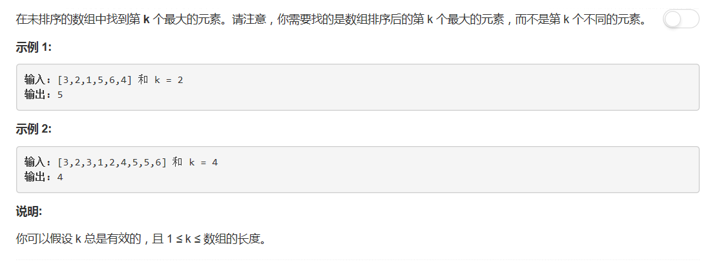

# 215 - 数组中的第K个最大元素

## 题目描述


>关联题目： [414. 第三大的数](https://github.com/Rosevil1874/LeetCode/tree/master/Python-Solution/414_Third-Maximum-Number)   
此题中的k是变量，大小未知，继续用414题中的方法肯定就行不通了。
所幸这题不用去重也没有时间复杂度限制嘿嘿嘿(ღ˘︶˘ღ)，恩思路基本就是排序了。

## 一：原生sort函数
一行代码，你值得拥有，啾咪~
```python
class Solution(object):
    def findKthLargest(self, nums, k):
        """
        :type nums: List[int]
        :type k: int
        :rtype: int
        """
        return sorted(nums)[-k]
```

## 二：选择排序
```pyhton
class Solution(object):
    def findKthLargest(self, nums, k):
        """
        :type nums: List[int]
        :type k: int
        :rtype: int
        """
        n = len(nums)
        for i in range(n, n - k, -1):
            maxIdx = 0
            for j in range(i):
                if nums[j] > nums[maxIdx]:
                    maxIdx = j
            nums[maxIdx], nums[i - 1] = nums[i - 1], nums[maxIdx]
        return nums[-k]
```

## 二：选择排序
```pyhton
class Solution(object):
    def findKthLargest(self, nums, k):
        """
        :type nums: List[int]
        :type k: int
        :rtype: int
        """
        n = len(nums)
        for i in range(n, n - k, -1):
            maxIdx = 0
            for j in range(i):
                if nums[j] > nums[maxIdx]:
                    maxIdx = j
            nums[maxIdx], nums[i - 1] = nums[i - 1], nums[maxIdx]
        return nums[-k]
```

## 三、快速选择 Quick Select
**Quick Select算法：**  
1. Quick select算法通常用来在未排序的数组中寻找第k小/第k大的元素。其方法类似于Quick sort。
2. Quick select算法因其高效和良好的average case时间复杂度而被广为应用。Quick select的average case时间复杂度为O(n)，然而其worst case时间复杂度为O(n^2)。
3. 总体而言，Quick select采用和Quick sort类似的步骤。首先选定一个pivot，然后根据每个数与该pivot的大小关系将整个数组分为两部分。与Quick sort不同的是，Quick select只考虑所寻找的目标所在的那一部分子数组，而非像Quick sort一样分别再对两边进行分割。正是因为如此，Quick select将平均时间复杂度从O(nlogn)降到了O(n)。

以下代码cr: [C++ Solutions](https://leetcode.com/problems/kth-largest-element-in-an-array/discuss/60309/4-C++-Solutions-using-Partition-Max-Heap-priority_queue-and-multiset-respectively)  

>思路：  
1. Initialize left to be 0 and right to be len(nums) - 1;
2. Partition the array, if the pivot is at the k-1-th position, return it (we are done);
3. If the pivot is right to the k-1-th position, update right to be the left neighbor of the pivot;
4. Else update left to be the right neighbor of the pivot.
Repeat 2.

```pyhton
class Solution(object):
    def findKthLargest(self, nums, k):
        """
        :type nums: List[int]
        :type k: int
        :rtype: int
        """
        left, right = 0, len(nums) - 1
        while left <= right:
            pos = self.partition(nums, left, right)
            if pos > k - 1:          
                right = pos - 1
            elif pos < k - 1:
                left = pos + 1
            else:
                return nums[pos]
        
    # 返回第r小的元素，即第n-r大的元素
    def partition(self, nums, left, right):
        pivot = nums[left]
        l, r = left + 1, right
        while  l <= r:
            if nums[l] < pivot and nums[r] > pivot:
                nums[l], nums[r] = nums[r], nums[l]
                l += 1
                r -= 1
            elif nums[l] >= pivot:
                l += 1
            elif nums[r] <= pivot:
                r -= 1
        nums[left], nums[r] = nums[r], nums[left]
        return r
```