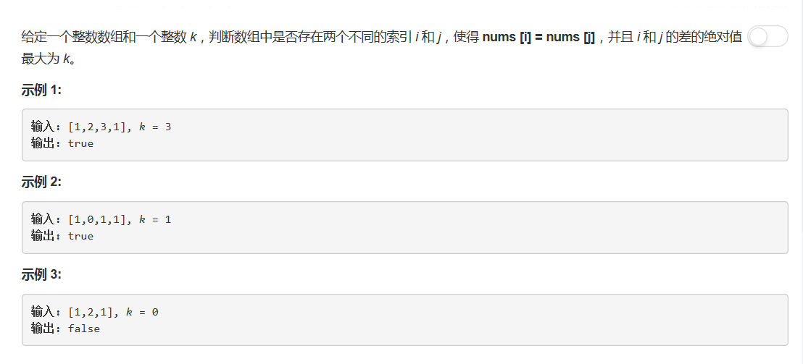
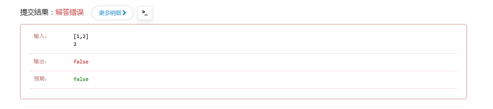

# 219 - 存在重复元素II

## 题目描述


>关联题目： [217. 存在重复元素](https://github.com/Rosevil1874/LeetCode/tree/master/Python-Solution/217_Contains-Duplicate)  
>关联题目： [220. 存在重复元素III](https://github.com/Rosevil1874/LeetCode/tree/master/Python-Solution/220_Contains-Duplicate-III)  

## 字典
**思路**
1. 建立一个空的dict；
2. 遍历nums：
    - 若字典中存在此元素即出现重复，判断其索引与前一次出现时的索引相差是否最大为k，是则立即返回True；
    - 否则为第一次出现，将元素及其索引加入字典；
3. 若遍历完还没有重复，返回False。

>时间复杂度O(n)，空间复杂度O(1)

```python
class Solution(object):
    def containsNearbyDuplicate(self, nums, k):
        """
        :type nums: List[int]
        :type k: int
        :rtype: bool
        """
        if len(nums) == 0 or len(nums) == 1:
            return False

        d = dict()
        for i in range(len(nums)):
            if nums[i] in d and i - d[nums[i]] <= k:
                return True
            d[nums[i]] = i
        return False
```

或者这样遍历：
```python
class Solution(object):
    def containsNearbyDuplicate(self, nums, k):
        """
        :type nums: List[int]
        :type k: int
        :rtype: bool
        """
        d = {}
        for i, val in enumerate(nums):
            if val in d and i - d[val] <= k:
                return True
            d[val] = i
        return False
```

虽然我之前是把最大为k看成了最小为k，但是你也不能这样对我吧_(°ω°｣∠)_  
这个error没有的哈已经解决了的哈，只是贴出来开心开心(◕ᴗ◕✿)
