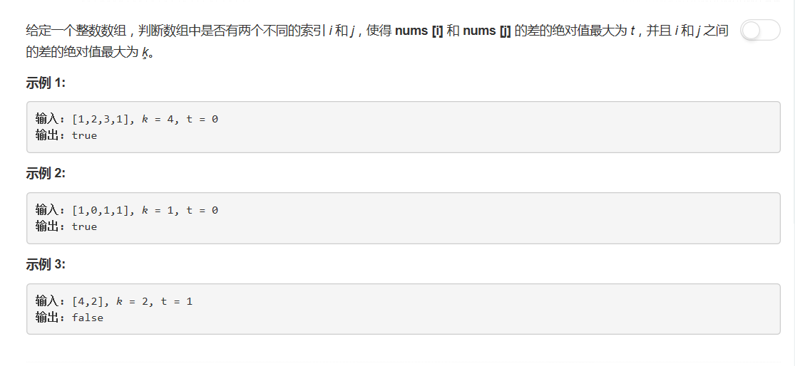
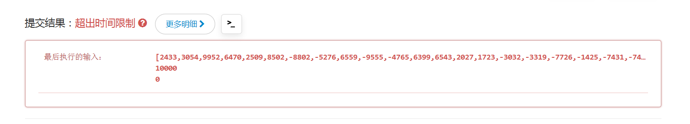

# 220 - 存在重复元素III

## 题目描述


>关联题目： [217. 存在重复元素](https://github.com/Rosevil1874/LeetCode/tree/master/Python-Solution/217_Contains-Duplicate)  
>关联题目： [219. 存在重复元素II](https://github.com/Rosevil1874/LeetCode/tree/master/Python-Solution/219_Contains-Duplicate-II)  

## 字典
**思路**
1. 建立一个空的dict；
2. 遍历nums：
    - 若字典中存在此元素即出现重复，判断其索引与前一次出现时的索引相差是否最大为k，是则立即返回True；
    - 否则为第一次出现，将元素及其索引加入字典；
3. 若遍历完还没有重复，返回False。

>时间复杂度O(n)，空间复杂度O(1)

```python
class Solution(object):
    def containsNearbyAlmostDuplicate(self, nums, k, t):
        """
        :type nums: List[int]
        :type k: int
        :type t: int
        :rtype: bool
        """
        d = {}
        for i, val in enumerate(nums):
            for key in d.keys():
                if abs(key - val) <= t and i - d[key] <= k:
                    return True
            d[val] = i
        return False
```

看到两层的遍历就觉得会超时，果然。。。


在将新的键值对插入字典后对字典按key排序：  
`sorted(d.items(), key=lambda e:e[0])`  —— e[0]代表字典的key, e[1]代表字典的value，
仍超时。

## 桶排序
>好了不挣扎了，看看人家的思路。。 [AC O(N) solution in Java using buckets with explanation](https://leetcode.com/problems/contains-duplicate-iii/discuss/61645/AC-O(N)-solution-in-Java-using-buckets-with-explanation)  
idea:  
The idea is like the bucket sort algorithm. Suppose we have consecutive buckets covering the range of nums with each bucket a width of (t+1). If there are two item with difference <= t, one of the two will happen:
1. the two in the same bucket
2. the two in neighbor buckets


思路：
1. 桶的容量初始化为`t+1`，则处于同一个桶内的元素差必然不大于t;
2. 两个元素之间的关系有三种情况：
    - 在同一个桶内，则元素差必然不大于t，可直接返回True;
    - 在相邻桶内，此时元素之差可能不大于t，需要进一步判断再返回；
    - 其他情况，元素差必然大于t，不用考虑了。
3. 若未在桶内找到符合条件的元素（上面的第三种情况），则将当前元素加入相应桶内；
4. 若元素索引超过了k，则可以把桶中与当前元素索引差超过k的记录删除，因为在其中找到的元素不可能满足索引差不超过k这个条件了。

```python
class Solution(object):
    def containsNearbyAlmostDuplicate(self, nums, k, t):
        """
        :type nums: List[int]
        :type k: int
        :type t: int
        :rtype: bool
        """
        if t < 0:
            return False

        d = {}
        w = t + 1           # 桶的容量
        for i, val in enumerate(nums):
            n = val // w    # 分配到第n个桶
            
            # 1. 当前元素与之前出现过的某元素在同一个桶内，则其值之差不大于t
            if n in d:      
                return True

            # 2. 当前元素在之前出现过的某元素的前一个桶内，则需判断其值之差是否不大于t
            if n - 1 in d and abs(val - d[n - 1]) < w :
                return True
            
            # 3. 当前元素在之前出现过的某元素的后一个桶内，则需判断其值之差是否不大于t
            if n + 1 in d and abs(val - d[n + 1]) < w :
                return True

            # 将元素放入相应桶内
            d[n] = val

            # 删除桶中索引之差超过k的元素
            if i >= k:
                del d[nums[i - k] // w]

        return False
```
