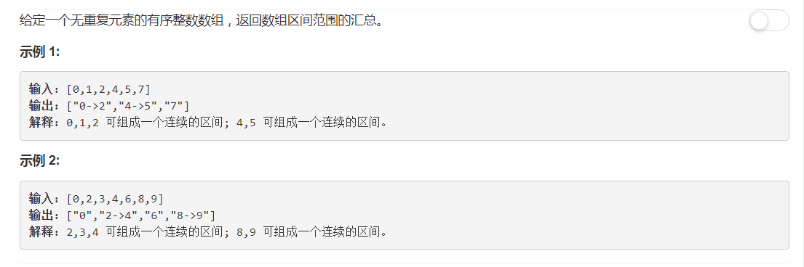

# 228 - 汇总区间

## 题目描述


## 题解一
**思路：**  
1. 当数组只有一个元素时，直接返回其字符串形式的数组；
2. 遍历nums：
    - 若出现不连续的情况则将前一个连续区间加入结果集，继续判断后面的序列；
    - 若为最后一个元素：不连续则直接加入此元素结果集，连续则加入其所在的连续区间。

>时间复杂度O(n)，空间复杂度O(1)

```python
class Solution:
    def summaryRanges(self, nums):
        """
        :type nums: List[int]
        :rtype: List[str]
        """
        if len(nums) == 1:
            return [ str(nums[0]) ]
        
        res = []
        start = 0
        for i in range(1, len(nums)):
            if nums[i] - nums[i - 1] != 1:
                end = i - 1
                if end == start:
                    res.append( str(nums[start]) )
                else:
                    res.append( str(nums[start]) + '->' + str(nums[end]) )

                if i != len(nums) - 1:
                    start = i
                else:
                    res.append( str(nums[i]) )
            elif i == len(nums) - 1:
                res.append( str(nums[start]) + '->' + str(nums[i]) )
                
        return res
```

### 简化代码
```python
class Solution:
    def summaryRanges(self, nums):
        """
        :type nums: List[int]
        :rtype: List[str]
        """
        if len(nums) == 1:
            return [ str(nums[0]) ]

        res = []
        i = 0
        while i < len(nums):
            start = nums[i]
            while i + 1 < len(nums) and nums[i + 1] - nums[i] == 1:
                i += 1
            if nums[i] != start:
                res.append( str(start) + '->' + str(nums[i]) )
            else:
                res.append( str(nums[i]) )
            i += 1
                
        return res
```

<center>
    **大家好，以下又是我偶像StefanPochmann的show time＼＼\٩('ω')و//／／**  
    思路都是一样的，不过人家的code就是优雅
</center>

## 题解二
**二维数组**    
 逗号不能省, **关于`ranges += [],`**  
 相当于`ranges += [[]]`或者`ranges.append([])`,  
 而`ranges += []`只会添加[]中的元素到ranges而不会添加[]本身，也就是啥也加不进去。。。

```python
class Solution:
    def summaryRanges(self, nums):
        ranges = []
        for x in nums:
            if not ranges or x > ranges[-1][-1] + 1:
                ranges += [],
            ranges[-1][1:] = x,
        return ['->'.join(map(str, r)) for r in ranges]
```

## 题解三
**用一个只有两个元素的数组r代替ranges的第二维**
1. **关于`ranges += r,`的逗号**  
"Like in ranges ? That creates a tuple so that `r` is added as an element itself rather than its elements being added. Same as `ranges += [r]` or `ranges.append(r)`, but shorter and faster (according to some tests I did a while back)."
2. **关于`r[1:] = x,`**  
“That's the best part of the whole solution :-). It replaces the slice on the left side by the (elements of the) **tuple** on the right side. So it replaces everything after the first element in `r` (or everything, in case r is empty) by just `x`. That is, [] becomes [x] (setting the start value of the range), and [a] and [a,b] both become [a,x] (adding/updating the end value of the range).”  

```python
class Solution:
    def summaryRanges(self, nums):
        ranges, r = [], []
        for x in nums:
            if x - 1 not in r:
                r = []
                ranges += r,
            r[1:] = x,
        return ['->'.join(map(str, r)) for r in ranges]
```

## 题解四
**SP说这是他的tricky版本(눈‸눈)，呵呵呵呵呵，我觉得它的每个版本都tricky(눈‸눈)**
```python