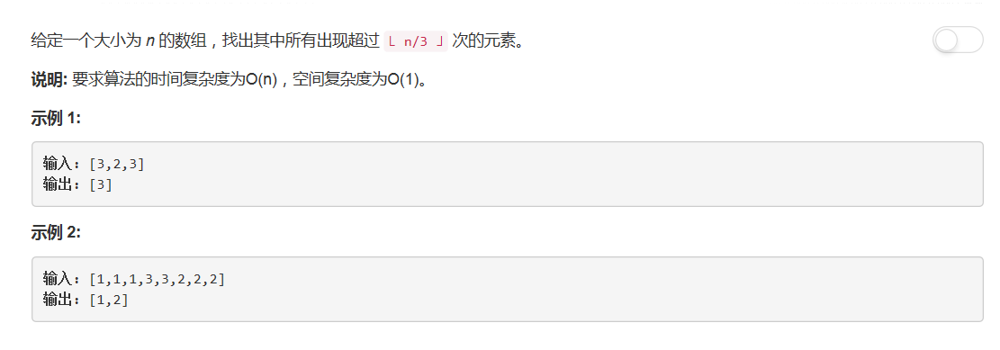

# 229 - 求众数II

## 题目描述


>关联题目： [169. 求众数](https://github.com/Rosevil1874/LeetCode/tree/master/Python-Solution/169_Majority-Element)

>审题：  
1. 要求时间复杂度为O(n)：排序法、分治法排除；
2. 空间复杂度为O(1)：hash法排除；
3. 返回值可能是1个或2个：位操作排除。
So...投票算法胜出＼＼\٩('ω')و//／／

## 投票算法
**时间复杂度: O(n)**

由于题目要求的是**超过 ⌊ n/3 ⌋ 次**，所以答案会是一到两个数字，把原算法改为计算两个candidates的count。
思路：  
1. 两个变量candidate和count。candidate记录当前可能的候选众数，count保存该候选众数出现的次数。
2. 遍历数组nums，对两个candidates和count：
	- 若当前元素与candidate相同，则计数count + 1；
	- 否则若count == 0则说明这个candidate不可能是众数了，将更新candidate为当前元素；
	- 否则count - 1。
3. 最后返回在数组中出现次数大于⌊ n/3 ⌋ 次的candidate。
```python
class Solution(object):
    def majorityElement(self, nums):
        """
        :type nums: List[int]
        :rtype: List[int]
        """
        if not nums:
            return []

        cnt1, cnt2, candidate1, candidate2 = 0, 0, 0, 1
        for val in nums:
            if val == candidate1:
                cnt1 += 1
            elif val == candidate2:
                cnt2 += 1
            elif cnt1 == 0:
                candidate1, cnt1 = val, 1
            elif cnt2 == 0:
                candidate2, cnt2 = val, 1
            else:
                cnt1, cnt2 = cnt1 - 1, cnt2 - 1
        return [x for x in (candidate1, candidate2) if nums.count(x) > len(nums)//3]
```