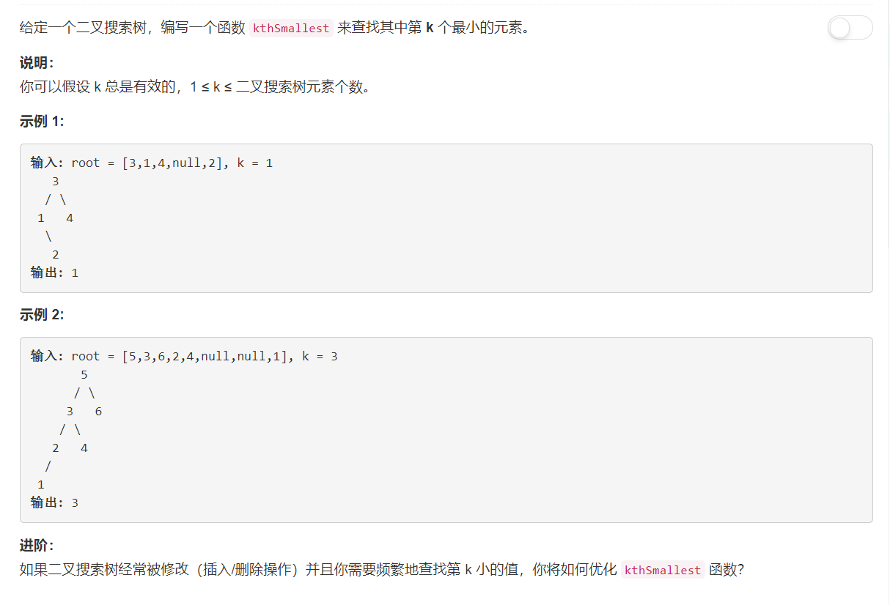

# 230 - 二叉搜索树中第K小的元素

## 题目描述


>关联题目： [671. 二叉树中第二小的节点](https://github.com/Rosevil1874/LeetCode/tree/master/Python-Solution/671_Second-Minimum-Node-In-a-Binary-Tree)


## 题解一：【BFS】
**思路：** 首先想到的就是使用第671题的BFS解法。

```python
# Definition for a binary tree node.
# class TreeNode(object):
#     def __init__(self, x):
#         self.val = x
#         self.left = None
#         self.right = None

class Solution(object):
    def kthSmallest(self, root, k):
        """
        :type root: TreeNode
        :rtype: int
        """
        q = [root]
        minimum = root.val
        vals = set()

        while q:
            node = q.pop(0)
            vals.add(node.val)
            if node.left:
                q.append(node.left)
            if node.right:
                q.append(node.right)
        return sorted(list(vals))[k-1]
```

## 题解二：
**思路：**
1. 才发现是二叉搜索树不是普通二叉树：设x是二叉搜索树中的一个结点。如果y是x左子树中的一个结点，那么 y.key <= x.key。如果y是x右子树中的一个结点，那么 y.key >= x.key。
2. 既然是二叉搜索树，当然中序遍历找第k小的值啊.

```python
# Definition for a binary tree node.
# class TreeNode(object):
#     def __init__(self, x):
#         self.val = x
#         self.left = None
#         self.right = None

class Solution(object):
    def kthSmallest(self, root, k):
        """
        :type root: TreeNode
        :rtype: int
        """
        for val in self.inorder(root):
        	if k == 1:
        		return val
        	else:
        		k -= 1

    def inorder(self, root):
    	if root:
    		for val in self.inorder(root.left):
    			yield val
    		yield root.val
    		for val in self.inorder(root.right):
    			yield val
```