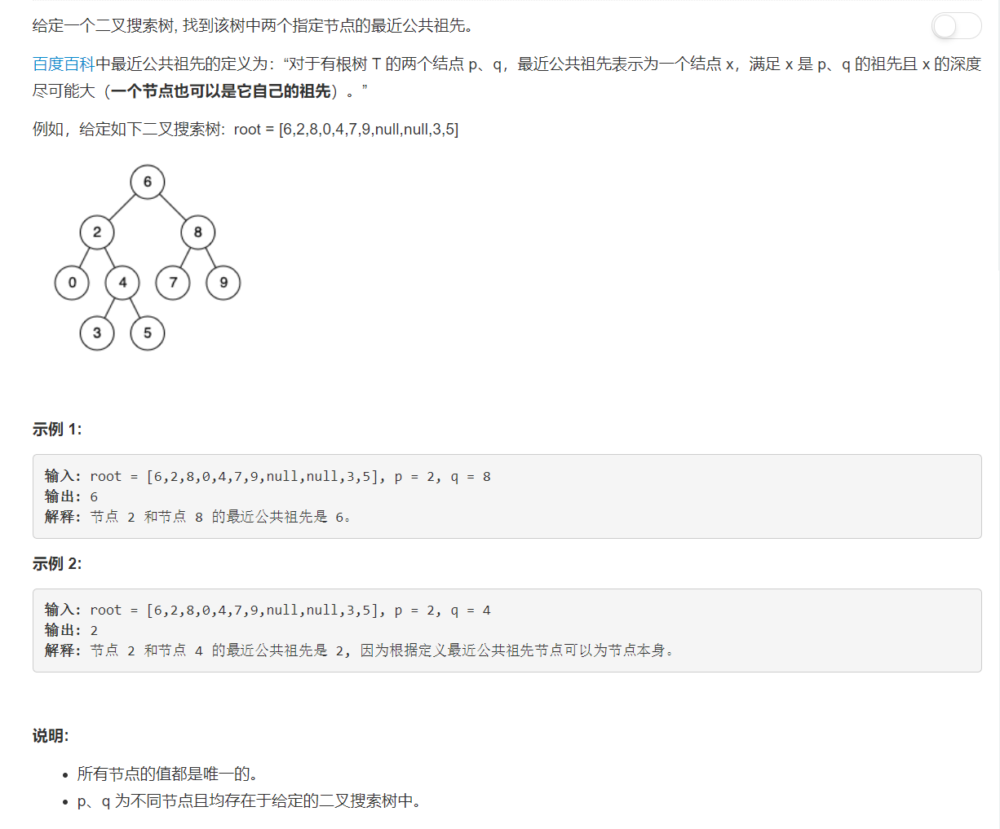

# 235 - 二叉搜索树的最近公共祖先

## 题目描述


>关联题目： 
[236. 二叉树的最近公共祖先](https://github.com/Rosevil1874/LeetCode/tree/master/Python-Solution/236_Lowest-Common-Ancestor-of-a-Binary-Tree)

## 方法：
>ref：[3 lines with O(1) space, 1-Liners, Alternatives](https://leetcode.com/problems/lowest-common-ancestor-of-a-binary-search-tree/discuss/64963/3-lines-with-O(1)-space-1-Liners-Alternatives)

1. 二叉搜索树的性质：左子节点<父节点<右子节点；
2. 比较root与p、q：
	- 若p、q同时小于root，则说明它俩都在左子树上，向左遍历；
	- 若p、q同时大于root，则说明它俩都在右子树上，向右遍历；
	- 若root的值处于两者之间，则说明p、q分别在左右子树上，root即为最近公共祖先，再往下走就分开啦；
	- 若root的值等于p，则说明p为q的祖先，也是它俩的最近公共祖先；root等于q时同理。
3. 依照以上步骤遍历二叉搜索树，前两种情况继续遍历，后两种情况返回root。

```python
# Definition for a binary tree node.
# class TreeNode(object):
#     def __init__(self, x):
#         self.val = x
#         self.left = None
#         self.right = None

class Solution(object):
    def lowestCommonAncestor(self, root, p, q):
        """
        :type root: TreeNode
        :type p: TreeNode
        :type q: TreeNode
        :rtype: TreeNode
        """
        while root:
        	if root.val > p.val and root.val > q.val:
        		root = root.left
        	elif root.val < p.val and root.val < q.val:
        		root = root.right
        	else:
        		return root
```

### 简化代码

>code 1

```python
# Definition for a binary tree node.
# class TreeNode(object):
#     def __init__(self, x):
#         self.val = x
#         self.left = None
#         self.right = None

class Solution(object):
    def lowestCommonAncestor(self, root, p, q):
        """
        :type root: TreeNode
        :type p: TreeNode
        :type q: TreeNode
        :rtype: TreeNode
        """
        while root:
        	if max(p.val, q.val) < root.val:
        		root = root.left
        	elif min(p.val, q.val) > root.val:
        		root = root.right
        	else:
        		return root
```

>code 2: x = (a, b)[c]语法，若满足c则x = b，不满足则 = a

```python
# Definition for a binary tree node.
# class TreeNode(object):
#     def __init__(self, x):
#         self.val = x
#         self.left = None
#         self.right = None

class Solution(object):
    def lowestCommonAncestor(self, root, p, q):
        """
        :type root: TreeNode
        :type p: TreeNode
        :type q: TreeNode
        :rtype: TreeNode
        """
        while (root.val- p.val)*(root.val - q.val) > 0:
        	root = (root.left, root.right)[min(p.val, q.val) > root.val]
        return root

   
```