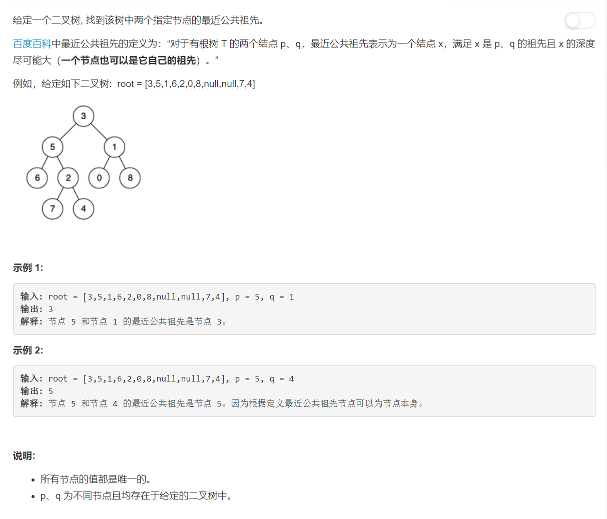

# 236 - 二叉树的最近公共祖先

## 题目描述


>关联题目： 
[235. 二叉搜索树的最近公共祖先](https://github.com/Rosevil1874/LeetCode/tree/master/Python-Solution/235_Lowest-Common-Ancestor-of-a-Binary-Search-Tree)

## 方法：
>ref：[Python simple recursive solution with detailed explanation](https://leetcode.com/problems/lowest-common-ancestor-of-a-binary-tree/discuss/152682/Python-simple-recursive-solution-with-detailed-explanation).PS.最近看到两次之前我经常看的那位大神StefanPochmann因为为了追求简化代码，写一些one-line或者行数很少的代码，而丢失了可读性，被大家指出来。所以说可读性还是最重要的呀，他的代码因此难以理解一点，这里参考的是另外一位的思路一样但是很清晰的解答。


```python
# Definition for a binary tree node.
# class TreeNode(object):
#     def __init__(self, x):
#         self.val = x
#         self.left = None
#         self.right = None

class Solution(object):
    def lowestCommonAncestor(self, root, p, q):
        """
        :type root: TreeNode
        :type p: TreeNode
        :type q: TreeNode
        :rtype: TreeNode
        """
        # 找到目标节点或空节点，则返回
        if root in (None, p, q):
            return root

        # 否则递归遍历左右子树，直到找到目标节点
        left = right = None
        if root.left:
            left = self.lowestCommonAncestor(root.left, p, q)
        if root.right:
            right = self.lowestCommonAncestor(root.right, p, q)

        # 若分别在当前根节点的左右子树中找到了p,q，则其为最近公共祖先
        if left and right:
            return root
        # 假设只在某一边子树中找到p，而在另一边子树中没有找到(返回None),则q在p所在子树所在位置更深的地方，此时没有必要再向下找
        else:
            return left or right
   
```
