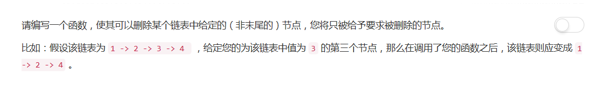

# 237 - 删除链表中的节点

## 题目描述


>审题：
前面有道题叫做删除链表中的元素，第203题。说实话这题没看懂它要表达的是啥。
哎呀！突然懂了！
因为看到函数参数是node而不是head哈哈哈，也就是说，传进去函数的这个节点就是待删除的结点，把它从其所在链表删除就行。相当于不给你它的前一个结点，让你只利用当前结点和后面的部分删除它自己。
注意：rtype: void. Do not return anything, modify node in-place instead.

## 方法
1. 把node的下一节点值赋给node；
2. 把当前结点的next指向下一节点的next

```python
# Definition for singly-linked list.
class ListNode(object):
    def __init__(self, x):
        self.val = x
        self.next = None

class Solution(object):
    def deleteNode(self, node):
        """
        :type node: ListNode
        :rtype: void Do not return anything, modify node in-place instead.
        """
        if not node or not node.next:
            return
        node.val = node.next.val
        node.next = node.next.next
        return
```