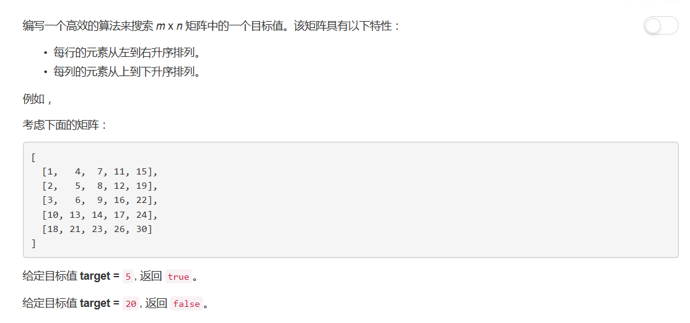

# 240 - 搜索二维矩阵II

## 题目描述


>关联题目： [74. 搜索二维矩阵](https://github.com/Rosevil1874/LeetCode/tree/master/Python-Solution/74_Search-a-2D-Matrix)  


## 二分查找
**根据矩阵的有序特点采用二分查找，和74题解法一一毛一样**

思路：
1. 特殊情况返回false：
    1. 矩阵不存在：None；
    2. 矩阵是一维空矩阵：[]；
    3. 矩阵是二维空矩阵：[[]]。
2. 遍历矩阵每一行，根据target与首尾元素的大小关系判断target是否在此行：
    1. 若target在此行，二分查找，若找到返回true；
    2. 若遍历完矩阵都不包括target，返回false。

```python
class Solution(object):
    def searchMatrix(self, matrix, target):
        """
        :type matrix: List[List[int]]
        :type target: int
        :rtype: bool
        """
        if not matrix:
            return False
        m = len(matrix)
        n = len(matrix[0])
        if m == 0 or n == 0:
            return False

        for i in range(m):
            if target >= matrix[i][0] and target <= matrix[i][n-1]:
                # 二分法查找
                left = 0
                right = n - 1
                while left <= right:
                    mid = (left + right) // 2
                    if matrix[i][mid] == target:
                        return True
                    elif matrix[i][mid] > target:
                        right = mid - 1
                    else:
                        left = mid + 1
        return False
```

## 降维 + 二分查找
> cr: [My concise O(m+n) Java solution](https://leetcode.com/problems/search-a-2d-matrix-ii/discuss/66140/My-concise-O(m+n)-Java-solution)

一个amazing solution，厉害厉害，思路如下：
> 1. We start search the matrix from top right corner, initialize the current position to top right corner.
2. if the target is greater than the value in current position, then the target can not be in entire row of current position because the row is sorted.
3.if the target is less than the value in current position, then the target can not in the entire column because the column is sorted too.
4. We can rule out one row or one column each time, so the time complexity is O(m+n).

```python
class Solution(object):
    def searchMatrix(self, matrix, target):
        """
        :type matrix: List[List[int]]
        :type target: int
        :rtype: bool
        """
        if not matrix:
            return False
        n = len(matrix)
        m = len(matrix[0])
        if m == 0 or n == 0:
            return False

        # 初始化位置到右上角
        row = 0
        col = m - 1
        while row <= n - 1 and col >= 0:
            if target == matrix[row][col]:
                return True
            elif target > matrix[row][col]:
                row += 1
            else:
                col -= 1
        return False
```

## trick

```python
class Solution:
    def searchMatrix(self, matrix, target):
        """
        :type matrix: List[List[int]]
        :type target: int
        :rtype: bool
        """
        if not matrix:
            return False
        m, n = len(matrix), len(matrix[0])
        if m == 0 or n == 0:
            return False
        
        i, j = 0, n - 1
        while i < m and j >= 0:
            if target < matrix[i][j]:
                j -= 1
            elif target > matrix[i][j]:
                i += 1
            else:
                return True
        return False
```