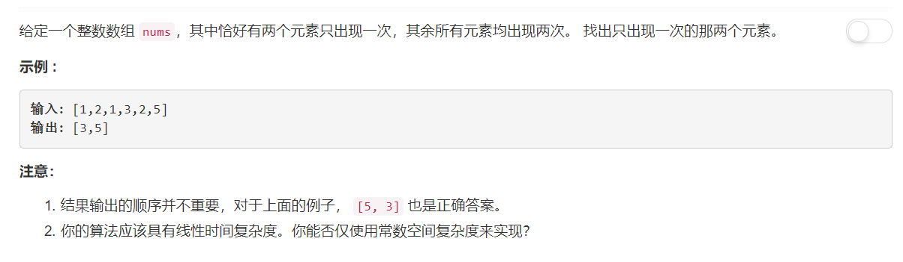

# 260 - 只出现一次的数字 III

## 题目描述


>关联题目： 
[137. 只出现一次的数字 II](https://github.com/Rosevil1874/LeetCode/tree/master/Python-Solution/137_Single-Number-II)
[260. 只出现一次的数字 III](https://github.com/Rosevil1874/LeetCode/tree/master/Python-Solution/260_Single-Number-III)


## 题解
**思路：**考虑到两个special number是不一样的，而恰好其余的数都是出现两次，所以如果对每个数都做亦或操作，最后的结果就是那两个special number的亦或，而且至少有一个位是1，那么就可以根据其中一个为1的位将所有的数分为两组，再套用第一个题的方法即可。

```python
class Solution(object):
    def singleNumber(self, nums):
        """
        :type nums: List[int]
        :rtype: int
        """
        single = 0
        for x in nums:
        	single ^= x
        return single
```