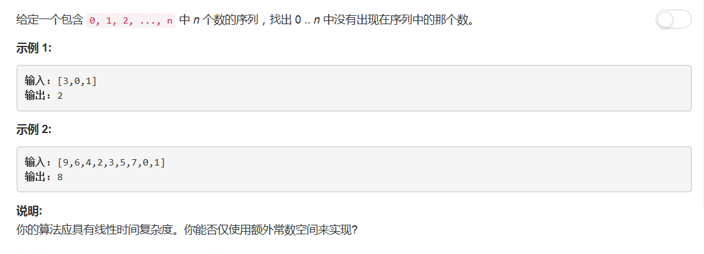

# 268 - 缺失数字

## 题目描述


>要求：  
1. 线性时间复杂度；
2. 常数额外空间；

## 一、暴力
**时间复杂度O(N)，无额外空间，显然不符合要求所以超时了**  

思路：  
按下标从0开始，依次查看下标代表的数是否在数组中。

```python
class Solution(object):
    def missingNumber(self, nums):
        """
        :type nums: List[int]
        :rtype: int
        """
        for i in range(len(nums)):
            if i not in nums:
                return i
        return len(nums)
```

**以下题解参考[3 different ideas: XOR, SUM, Binary Search. Java code](https://leetcode.com/problems/missing-number/discuss/69786/3-different-ideas:-XOR-SUM-Binary-Search.-Java-code)**

## 二、异或
思路：  
1. a^b^b = a;
2. 在没有缺失数字的完整数组中，索引和值应该完全对应（nums [index] = index），因此在丢失的数组中，最后剩下的就是丢失的数字。

>Runtime: 144 ms, faster than 76.32% of Python3 online submissions

```python
class Solution:
    def missingNumber(self, nums: List[int]) -> int:
        res = len(nums)
        for i in range(len(nums)):
            res ^= i
            res ^= nums[i]
        return res
```

## 三、求和
思路：  
1. 求出不缺数字的时候序列的和；
2. 求出实际序列的和；
3. 两和之差即为缺失的数。

> Runtime: 144 ms, faster than 76.32% of Python3 online submissions

```python
class Solution(object):
    def missingNumber(self, nums):
        """
        :type nums: List[int]
        :rtype: int
        """
        expectSum = sum(i for i in range(len(nums) + 1))
        realSum = sum(nums)
        return expectSum - realSum
```

## 四、二分查找
思路：  
1. 排序；
2. nums[mid] > mid：缺失的值在左边；
3. nums[mid] <= mid：缺失的值在右边；
4. left和right相遇时代表的就是缺失的值。

> Runtime: 140 ms, faster than 85.37% of Python3 online submissions  
其实排序之后就已经不是线性时间复杂度了。

```python
class Solution:
    def missingNumber(self, nums: List[int]) -> int:
        nums.sort()
        left, right = 0, len(nums) - 1
        
        while left <= right:
            mid = (left + right) // 2
            if nums[mid] > mid:
                right = mid - 1
            else:
                left = mid + 1
        return left
```