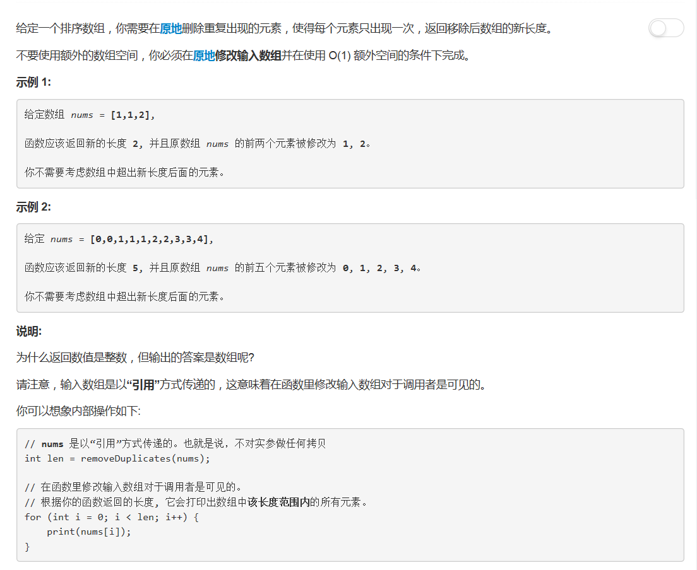

# 26 - 删除排序数组中的重复项

## 题目描述


>关联题目： [80. 删除排序数组中的重复项-II](https://github.com/Rosevil1874/LeetCode/tree/master/Python-Solution/80_Remove-Duplicates-from-Sorted-Array-II)

>审题：
1. 原地操作
2. 要注意返回的是数组的长度而不是数组

## 题解
思路：
1. 从下标1开始，依次和前面的元素比较；
2. 若相同，则删除当前元素，并更新数组长度（减一）；
3. 若不相同，下标后移一位。

```python
class Solution:
    def removeDuplicates(self, nums: List[int]) -> int:
        i = 1
        while i < len(nums):
            if nums[i] == nums[i - 1]:
                del nums[i]
            else:
                i += 1
        return len(nums)
```