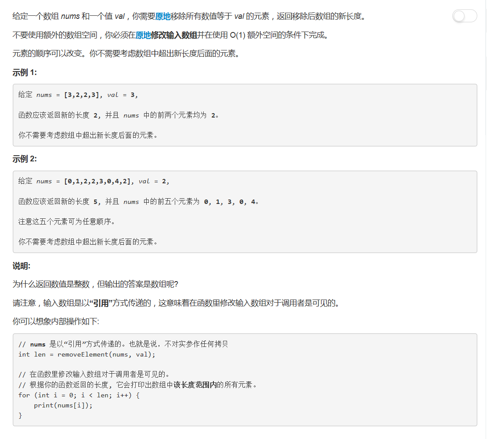

# 27 - 移除元素

## 题目描述


>审题：
1. 原地操作；
2. 要注意返回的是数组的长度而不是数组；
3. 不必保证相对位置不变；
4. 和26题类似。

## 题解
思路：
1. 遍历数组，依次和val比较；
2. 若相同，则删除当前元素，并更新数组长度（减一）；
3. 若不相同，下标后移一位。

```python
class Solution(object):
    def removeElement(self, nums, val):
        """
        :type nums: List[int]
        :type val: int
        :rtype: int
        """
        length = len(nums)
        i = 0
        while i < length:
            if nums[i] == val:
                del nums[i]
                length -= 1
            else:
                i += 1
        return length
```