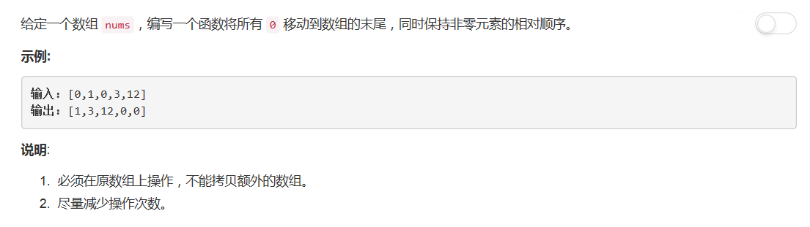

# 283 - 移动零

## 题目描述


## 题解一
**这个思路不是严格意义上的in-place**  

思路：  
1. 计算0出现的次数cnt；
2. 从数组头部开始查找0的位置并删除，在数组末尾添加0，进行cnt次。

```python
class Solution(object):
    def moveZeroes(self, nums):
        """
        :type nums: List[int]
        :rtype: void Do not return anything, modify nums in-place instead.
        """
        cnt = nums.count(0)
        for i in range(cnt):
        	idx = nums.index(0)
        	del nums[idx]
        	nums.append(0)
```

## 题解二
**in-place**  

思路：  
1. 一个变量记录0元素的位置；
2. 每次将0与后一个不是0的元素交换位置，直到换到最后。

```python
class Solution(object):
    def moveZeroes(self, nums):
        """
        :type nums: List[int]
        :rtype: void Do not return anything, modify nums in-place instead.
        """
        idx = 0
        for i in range(len(nums)):
        	if nums[i] != 0:
        		nums[i], nums[idx] = nums[idx], nums[i]
        		idx += 1
```