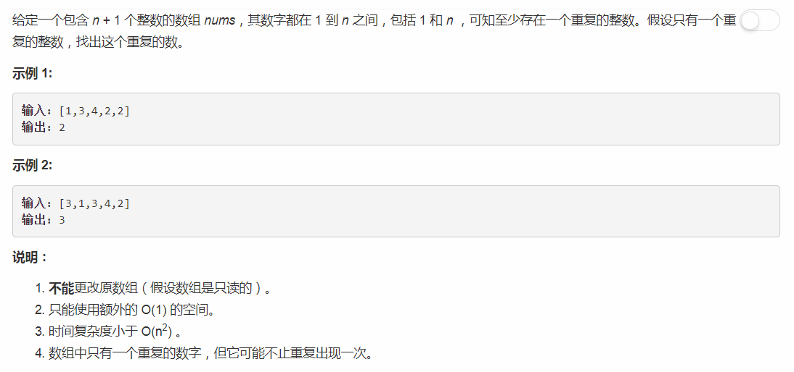
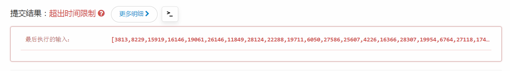

# 287 - 寻找重复数

## 题目描述


>关联题目： [142. 环形链表II](https://github.com/Rosevil1874/LeetCode/tree/master/Python-Solution/142_Linked-List-Cycle-II)    


## 一、暴力
看到题目要求时间复杂度小于Q(N^2)的呆瓜开心的写了个两层循环。
```python
class Solution:
    def findDuplicate(self, nums):
        """
        :type nums: List[int]
        :rtype: int
        """
        n = len(nums)
        for i in range(n):
            for j in range(i + 1, n):
                if nums[i] == nums[j]:
                    return nums[i]
```
果然超时。。。小于啊人家说小于，让你等于了吗 (눈‸눈)



## 二、双指针
和[142. 环形链表II](https://github.com/Rosevil1874/LeetCode/tree/master/Python-Solution/142_Linked-List-Cycle-II) 采用同样的思路：  
1. 使用两个移动速度不同的指针，fast指针的步长为slow指针的两倍；
2. 若两指针相遇则存在环,否则不存在环；
3. 相遇后fast指针不动，slow指针回到起点，两指针同时以相同步长前进，第二次相遇的节点即为环入口。

### 环入口为重复数：
>根据echoxiaolee的解答：  
“ the duplicate number must be the entry point of the circle when visiting the array from nums[0]. ”  
以及lxj9173提供的例子：  
“For example: [1,4,3,5,2,2] can be regard as : 1->4->2->3->5->2；  
Since: nums[0]=1; nums[1]=4; nums[4]=2; nums[2]=3; nums[3]=5; nums[5]=2;”
- slow: 1, 4, **2**, 3, 5, **2**
- fast: 4, 3, **2**, 5, 3, **2**

### 求环入口：
>示意图：

变量：
1. head到环路起点的距离为K，
2. 环路起点到两指针相遇点的距离为M，
3. 环路周长为L，
4. 两指针相遇时fast走了Lfast，slow走了Lslow。
推导：
1. lslow = K + M; Lfast = K + M + L\*n; Lfast = 2\*Lslow
2. Lslow = n * L; K = n * L - M
3. K = (n-1) * L + (l - M)
当slow回到head后走了K到达环路起点，L在环路里从M处开始也走了K，把公式里的M抵消掉，两个指针会在环路起点相遇。

```python
class Solution:
    def findDuplicate(self, nums):
        n = len(nums)
        if n <= 1:
            return -1

        slow = nums[0]
        fast = nums[nums[0]]
        while slow != fast:
            slow = nums[slow]
            fast = nums[nums[fast]]

        fast = 0
        while slow != fast:
            slow = nums[slow]
            fast = nums[fast]
        return slow
```


## 三、二分查找
**抽屉原则**:  
中译为“鸽巢原则”，即“把n+1个或者更多的物体放到n个集合之中，那么，至少有一个集合里要放进两个或者更多的物体”

思路： 将1~n当成是一个个的抽屉，出现重复元素的抽屉里至少需要装两个元素。 
1. 从mid抽屉开始判断，计算序列中小于等于mid的数的个数；
2. 若小于等于mid个数大于mid，则根据鸽巢原理得：重复数在[1:mid]之间，否则在[mid+1:n]；
3. 以此类推缩小范围，最后得到重复数。

```python
class Solution:
    def findDuplicate(self, nums: List[int]) -> int:
        left, right = 1, len(nums) - 1
        
        while left < right:
            mid = (left + right) // 2
            cnt = 0
            for i in nums:
                if i <= mid:
                    cnt += 1
            if cnt <= mid:
                left = mid + 1
            else:
                right = mid
                
        return left
```