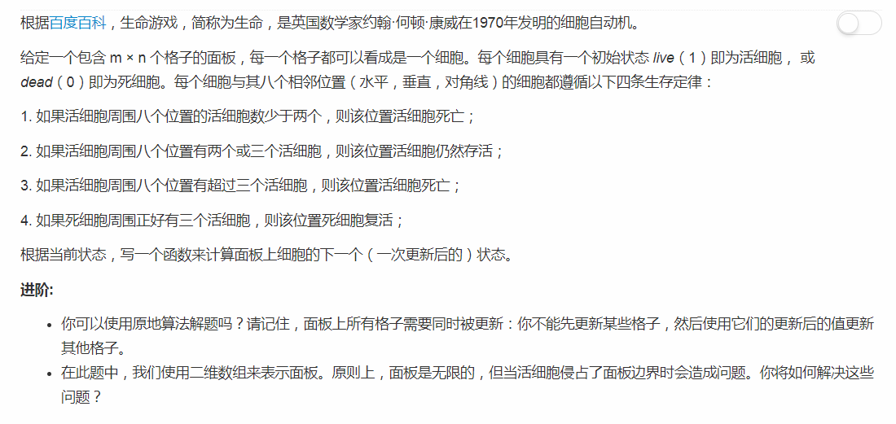
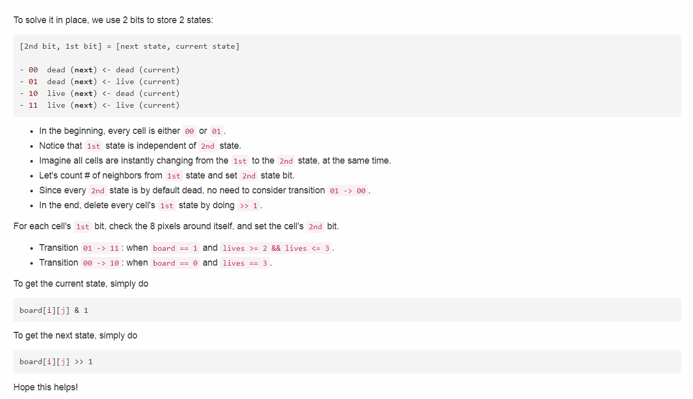

# 289 - 生命游戏

## 题目描述


## 题解
恩，承认除了暴力想不到其他办法出来，但是我要把这个怪到“如果活细胞周围八个位置有超过三个活细胞，则该位置活细胞死亡”头上，为什么呀为什么呀，对我就是一直在思考它为什么会挂掉所以阻碍了思维，一定是这样( ･´ω\`･ )

以下是同学的解答，可以说是非常容易理解了。
  

thanks, it's do helps me a lot。

```python
class Solution:
    def gameOfLife(self, board):
        """
        :type board: List[List[int]]
        :rtype: void Do not return anything, modify board in-place instead.
        """
        if not board or len(board) == 0:
            return

        m = len(board)
        n = len(board[0])
        for i in range(m):
            for j in range(n):
                lives = self.liveNeighbors(board, m, n, i, j)

                # 初始时bit2均为0，我们只关心它何时变为1 
                if board[i][j] == 1 and lives >= 2 and lives <= 3:
                    board[i][j] = 3      # 01 -> 11
                if board[i][j] == 0 and lives == 3:
                    board[i][j] = 2      # 00 -> 10

        for i in range(m):
            for j in range(n):
                board[i][j] >>= 1        # Get the 2nd state.

    def liveNeighbors(self, board, m, n, i, j):
        lives = 0
        for x in range(max(i - 1, 0), min(i + 1, m - 1) + 1):
            for y in range(max(j - 1, 0), min(j + 1, n - 1) + 1):
                lives += board[x][y] & 1
        lives -= board[i][j] & 1
        return lives
```
